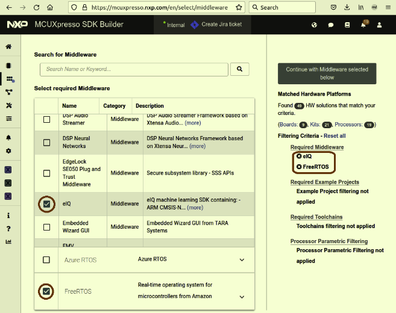
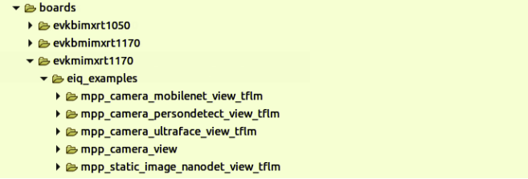
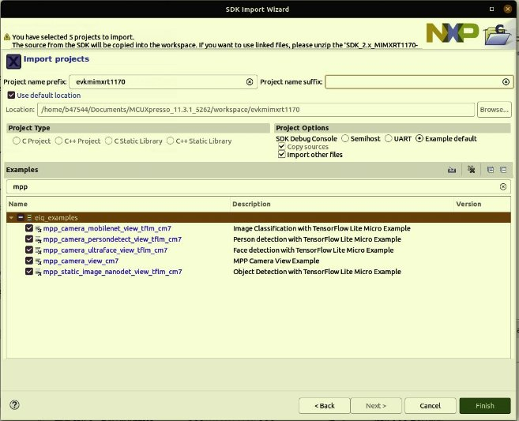
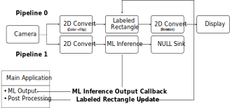
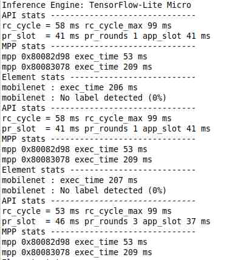
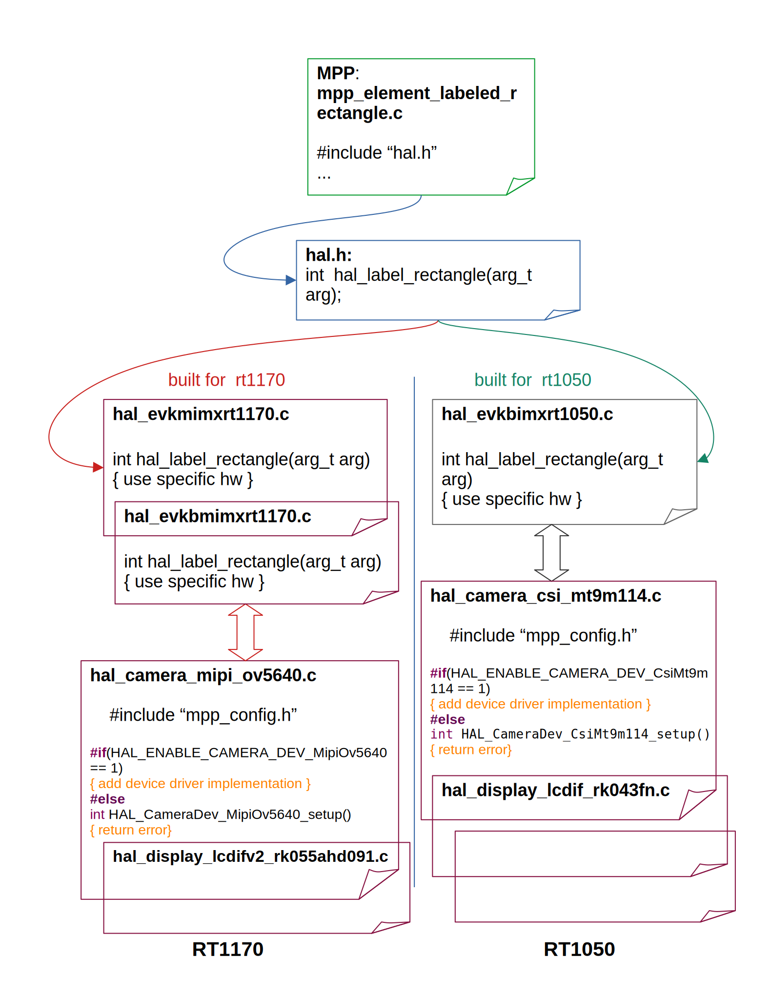

# eIQ Media Processing Pipeline User's Guide

 **EIQMPPUG**

**eIQ Media Processing Pipeline User's Guide**

**Rev. 1 — 24 December 2024 User guide**

**Document information**

|**Information**|**Content**|
| - | - |
|Keywords|eIQ, Media, Media Processing, Processing Pipeline, Library|
|Abstract|This document describes the Media Processing Pipeline software library for MCUs. The library is used for constructing media-handling components graphs for Vision-specific applications.|

**NXP Semiconductors EIQMPPUG**

**eIQ Media Processing Pipeline User's Guide**

**1   MCU Media Processing Pipeline**

This document describes the MCU Media Processing Pipeline API.

1. **Features overview**

The Media Processing Pipeline for MCUs is a software library for constructing graphs of media-handling components for Vision-specific applications.

This is a clean and simple API which makes it easy to build and prototype vision-based applications.

**1.1.1  Concept**

The concept behind the API is to create a Media Processing Pipeline (MPP) based on processing elements. The basic pipeline structure - the *mpp* in the API context - has a chain/queue structure which begins with a **source element**:

- Camera
- Static image

The pipeline continues with multiple **processing elements** having a single input and a single output:

- Image format conversion
- Labeled rectangle drawing
- Machine learning inference with the Tensorflow Lite Micro framework.

The pipeline can be closed by adding a **sink element**:

- Display panel
- Null sink

An *mpp* can also be **split** when the same media stream must follow different processing paths.

Compatibility of elements and supplied parameters are checked at each step and only compatible elements can be added in an unequivocal way.

After the construction is complete, each *mpp* must be started for all hardware, and software required to run the pipeline to initialize. Pipeline processing begins as soon as the the last start call is flagged.

Each pipeline branch can be stopped individually. The process involves stopping the execution and the hardware peripherals of the branch. After being stopped, each branch can be started again. To stop the whole pipeline, you must stop each of its branches separately.

At runtime, the application receives events from the pipeline processing and may use these events to update the elements parameters. For example, in object detection when the label of a bounding box must be updated whenever a new object is detected.

Summarizing, the application controls:

- Creation of the pipeline
- Instantiation of processing elements
- Connection of elements to each other
- Reception of callbacks based on specific events
- Updating specific elements (not all elements can be updated)
- Stopping the pipeline (includes shut down of the hardware peripherals)

Application does not control:

- Memory management
- Data structures management

The order in which an element is added to the pipeline defines its position within this pipeline, and therefore the order is important.

2. **Example and references**

See the examples/reference documentation for practical examples using the MPP API.

**2   Deployment**

The eIQ Media Processing Pipeline is part of the eIQ machine learning software package, which is an optional middleware component of MCUXpresso SDK.

The eIQ component is integrated into the MCUXpresso SDK Builder delivery system available on [mcuxpresso.nxp.com](https://mcuxpresso.nxp.com/).

To include eIQ Media Processing Pipeline into the MCUXpresso SDK package, select both “eIQ” and “FreeRTOS” in the software component selector on the SDK Builder page.

For details, see, [Figure 1](#_page3_x50.00_y120.00).

**Figure 1. MCUXpresso SDK Builder software component selector**

Once the MCUXpresso SDK package is downloaded, it can be extracted on a local machine or imported into the MCUXpresso IDE. For more information on the MCUXpresso SDK folder structure, see the Getting Started with MCUXpresso SDK User’s Guide (document: [MCUXSDKGSUG](https://www.nxp.com/webapp/Download?colCode=MCUXSDKGSUG&location=null)). The package directory structure is similar to [Figure 2](#_page4_x50.00_y120.00) and [Figure 3](#_page4_x50.00_y314.28). The eIQ Media Processing Pipeline directories are highlighted in red.

**Figure 2. MCUXpresso SDK directory structure for examples**

**Figure 3. MCUXpresso SDK directory structure for mpp**

The *boards* directory contains example application projects for supported toolchains. For the list of supported toolchains, see the *MCUXpresso SDK Release Notes*. The *middleware* directory contains the eIQ library source code and example application source code and data.

**3   Example applications**

1. **How to get examples**

The eIQ Media Processing Pipeline is provided with a set of example applications. For details, see [Table 1](#_page5_x50.00_y120.00). The applications demonstrate the usage of the API in several use cases.

**Table 1. Example applications**

|**Name**|**Description**|**Availability**|
| - | - | - |
|mpp\_camera\_view|This basic example shows how to use the library to create a simple camera preview pipeline.|EVK-MIMXRT1170 EVKB-MIMXRT1170 EVKB-IMXRT1050 FRDM-MCXN947|
|mpp\_camera\_mobilenet\_view\_ tflm|
This example shows how to use the library to create an image classification use case using camera as a source.

The machine learning framework used is TensorFlow Lite Micro.

The image classification model used is quantized Mobilenet convolution neural network model that classifies the input image into one of 1000 output classes.
|EVK-MIMXRT1170 EVKB-MIMXRT1170 EVKB-IMXRT1050 FRDM-MCXN947|
|mpp\_camera\_ultraface\_view\_ tflm|
This example shows how to use the library to create a use case for face detection using camera as a source.

To generate a new static image for this example, rsee the documentation at: eiq/mpp/tools/image\_ conversion.readme.

The machine learning framework used is TensorFlow Lite Micro.

The face detection model used is quantized Ultraface slim model that detects multiple faces in an input image.
|EVK-MIMXRT1170 EVKB-MIMXRT1170 EVKB-IMXRT1050 FRDM-MCXN947|
|mpp\_static\_image\_nanodet\_ m\_view\_tflm|
This example shows how to use the library to create an object detection use case using a static image as a source.

The machine learning framework is TensorFlow Lite Micro.

The object detection model used is quantized Nanodet m with two output tensors. The model performs multiple objects detection among 80 classes.

The application also performs Intersection Over Union (IOU) and Non-Maximum Suppression (NMS) to pick the best box for each detected object.
|EVK-MIMXRT1170 EVKB-MIMXRT1170 EVKB-IMXRT1050 FRDM-MCXN947|

For details on how to build and run the example applications with supported toolchains, see *Getting Started with MCUXpresso SDK User’s Guide* (document: MCUXSDKGSUG).

When using MCUXpresso IDE, the example applications can be imported through the SDK Import Wizard as shown in [Figure 4](#_page6_x50.00_y120.00).

**Figure 4. MCUXpresso SDK import projects wizard**

The build scripts for GCC toolchain in are in SDK folder /boards/<board\_name>/eiq\_examples/ <example\_name>/armgcc/.

2. **Description of the mpp\_camera\_mobilenet\_view example**

This section provides a short description of the mpp\_camera\_mobilenet\_view application.

This example shows how to use the library to create a use case for image classification using camera as source.

The image classification model used is quantized Mobilenet convolutional neural network model [1](#_page6_x50.00_y754.29) that classifies the input image into one of 1000 output classes.

- **High-level description**

1 <https://www.tensorflow.org/lite/models>

 **

**ML Inference Output Callback Labeled Rectangle Update**

**Figure 5. Application overview**

- **Detailed description**

  The application creates two pipelines:

- One pipeline that runs the camera preview.
- Another pipeline that runs the ML inference on the image coming from the camera.
- Pipeline 1 is split from Pipeline 0.
- Pipeline 0 executes the processing of each element sequentially and cannot be preempted by another pipeline.
- Pipeline 1 executes the processing of each element sequentially but can be preempted.
- **Pipelines elements description**
- Camera element is configured for a specific pixel format and resolution (board dependent).
- Display element is configured for a specific pixel format and resolution (board dependent).
- 2D converts element on pipeline 0 is configured to perform:
  - color space conversion from the camera pixel format to the display pixel format.
  - rotation depending on the display orientation compared to the landscape mode.

    ***Note:**  To get labels in the right orientation, the rotation is performed after the labeled-rectangle.*

- 2D converts element on pipeline 1 is configured to perform:
  - color space conversion from the camera pixel format to RGB888.
  - cropping to maintain image aspect ratio.
  - scaling to 128 \* 128 as mandated by the image classification model.
- The labeled rectangle element draws a crop window from which the camera image is sent to the ML inference element. The labeled rectangle element also displays the label of the object detected.
- The ML inference element runs an inference on the image pre-processed by the 2D convert element.
- The NULL sink element closes pipeline 1 (in MPP concept, only sink elements can close a pipeline).
- At every inference, the ML inference element invokes a callback containing the inference outputs. These outputs are post-processed by the callback client component. In this case, it is the main task of the application.
3. **Output example**

After building the example application and downloading it to the target, the execution stops in the *main* function. When the execution resumes, an output message displays on the connected terminal. For example, [Figure 6](#_page8_x50.00_y190.90) shows the output of the mpp\_camera\_mobilenet\_view\_tflm example application printed to the MCUXpresso IDE Console window when semihosting debug console is selected in the SDK Import Wizard.

**Figure 6. PuTTY console window**

**4   API references**

**4.1  Module documentation**

This section provides information on:

- MPP API
- MPP types
- Return codes
1. **MPP API**
1. **Functions**
- int [mpp_api_init](#_page9_x98.86_y378.36) ([mpp_api_params_t](#_page16_x98.86_y299.39) \*params)
- [mpp_t ](#_page23_x98.86_y298.37)[mpp_create](#_page9_x98.86_y575.38) ([mpp_params_t](#_page16_x98.86_y429.27) \*params, int \*ret)
- int [mpp_camera_add](#_page10_x98.86_y116.44) ([mpp_t](#_page23_x98.86_y298.37) mpp, const char name, [mpp_camera_params_t ](#_page16_x98.86_y567.69)\*params,)
- int [mpp_static_img_add](#_page10_x98.86_y311.06) ([mpp_t](#_page23_x98.86_y298.37) mpp, [mpp_img_params_t ](#_page17_x98.86_y116.44)\*params, void \*addr)
- int [mpp_display_add](#_page10_x98.86_y541.67) ([mpp_t](#_page23_x98.86_y298.37) mpp, const char \* name, [mpp_display_params_t ](#_page17_x98.86_y242.72)\*params)
- int [mpp_nullsink_add](#_page11_x98.86_y116.44) ([mpp_t](#_page23_x98.86_y298.37) mpp)
- int [mpp_element_add](#_page11_x98.86_y295.46) ([mpp_t](#_page23_x98.86_y298.37) mpp, [mpp_element_id_t](#_page26_x98.86_y164.01) id, [mpp_element_params_t ](#_page20_x104.98_y255.49)\*params, [mpp_elem_handle_t ](#_page23_x98.86_y375.64) \*elem\_h)
- int [mpp_split](#_page11_x98.86_y574.91) ([mpp_t](#_page23_x98.86_y298.37) mpp, unsigned int num, [mpp_params_t ](#_page16_x98.86_y429.27)\*params, [mpp_t ](#_page23_x98.86_y298.37)\*out\_list)
- int [mpp_background](#_page12_x98.86_y223.21) ([mpp_t ](#_page23_x98.86_y298.37) mpp, [mpp_params_t ](#_page16_x98.86_y429.27) params,[mpp_t ](#_page23_x98.86_y298.37) out\_mpp)
- int mpp\_element\_update ([mpp_t](#_page23_x98.86_y298.37) mpp, [mpp_elem_handle_t](#_page23_x98.86_y375.64) elem\_h, [mpp_element_params_t ](#_page20_x104.98_y255.49)\*params)
- int [mpp_start](#_page12_x104.37_y641.07) ([mpp_t](#_page23_x98.86_y298.37) mpp, int last)
- int [mpp_stop](#_page13_x104.98_y226.21) ([mpp_t](#_page23_x98.86_y298.37) mpp)
- void [mpp_stats_enable](#_page13_x104.98_y405.23) ([mpp_stats_grp_t ](#_page24_x98.86_y398.75) grp)
- void [mpp_stats_disable](#_page13_x104.98_y556.25) ([mpp_stats_grp_t ](#_page24_x98.86_y398.75) grp)
- char \*[mpp_get_version](#_page13_x104.98_y708.32) (void)
2. **Detailed Description**

This section provides the detailed documentation for the MCU Media Processing Pipeline API.

3. **Function Documentation**
1. **mpp\_api\_init()**

int mpp\_api\_init (mpp\_api\_params\_t  \*params)

Pipeline initialization.

This function initializes the library and its data structures.

It must be called before any other function of the API is called. **Parameters**

|in|*params*|API global parameters|
| - | - | - |

**Returns [Return_codes](#_page27_x80.54_y187.41)**

2. **mpp\_create()**

[mpp_t](#_page23_x98.86_y298.37) mpp\_create ([mpp_params_t](#_page16_x98.86_y429.27) \* params, int \* ret)

Basic pipeline creation.

This function returns a handle to the pipeline. **Parameters**

|in|*params*|pipeline parameters|
| - | - | - |
|out|*ret*|return code (0 - success, non-zero - error)|

**Returns**

A handle to the pipeline if success. NULL, if there is an error.

3. **mpp\_camera\_add()**

int mpp\_camera\_add ([mpp_t](#_page23_x98.86_y298.37) mpp, const char name, [mpp_camera_params_t](#_page16_x98.86_y567.69) \* params)

Camera addition.

This function adds a camera to the pipeline.

|in|*mpp*|input pipeline|
| - | - | - |
|in|*name*|camera driver name|
|in|*params*|parameters to be configured on the camera|

**Returns [Return_codes](#_page27_x80.54_y187.41)**

4. **mpp\_static\_img\_add()**

int mpp\_static\_img\_add ([mpp_t](#_page23_x98.86_y298.37) *mpp, [mpp_img_params_t](#_page17_x98.86_y116.44)* *params,* void *addr*)

Static image addition. **Parameters**

|in|*mpp*|input pipeline|
| - | - | - |
|in|*params*|static image parameters|
|in|*addr*|image buffer|

**Returns**

[Return_codes](#_page27_x80.54_y187.41)

**Preconditions**

Image buffer allocation/free is the responsibility of the user.

5. **mpp\_display\_add()**

int mpp\_display\_add ([mpp_t](#_page23_x98.86_y298.37) *mpp*, const char *name,* [mpp_display_params_t](#_page17_x98.86_y242.72) *params*)

Display addition.

This function adds a display to the pipeline.

|in|*mpp*|input pipeline|
| - | - | - |
|in|*name*|display driver name|
|in|*params*|parameters that are configured on the display|

**Returns [Return_codes](#_page27_x80.54_y187.41)**

6. **mpp\_nullsink\_add()**

int mpp\_nullsink\_add ([mpp_t](#_page23_x98.86_y298.37) *mpp*)

Null sink addition.

This function adds a null-type sink to the pipeline.

After this call pipeline is closed and no further elements can be added. Input frames are discarded.

|in|*mpp*|input pipeline|
| - | - | - |

**Returns [Return_codes](#_page27_x80.54_y187.41)**

7. **mpp\_element\_add()**

int mpp\_element\_add ([mpp_t](#_page23_x98.86_y298.37) *mpp,* [mpp_element_id_t](#_page26_x98.86_y164.01) *id,* [mpp_element_params_t](#_page20_x104.98_y255.49) *params*, [mpp_elem_handle_t](#_page23_x98.86_y375.64) *elem\_h*)

Add processing element (single input, single output). This function adds an element to the pipeline. Available elements are:

- 2D image processing
- ML inference engine
- Labeled rectangle
- Compositor

|in|*mpp*|input pipeline|
| - | - | - |
|in|*id*|element id|
|in|*params*|element parameters|
|out|elem\_h|element handle in pipeline|

**Returns [Return_codes](#_page27_x80.54_y187.41)**

8. **mpp\_split()**

int mpp\_split ([mpp_t](#_page23_x98.86_y298.37) *mpp,*unsigned int *num,*   [mpp_params_t](#_page16_x98.86_y429.27) *\* para*,   [mpp_t](#_page23_x98.86_y298.37) *out\_list*)

Pipeline multiplication. **Parameters**

|in|*mpp*|input pipeline|
| - | - | - |
|in|*num*|number of output pipeline|
|in|*params*|split mmp parameters|
|out|*out\_list*|list of output pipelines|

**Returns**

[Return_codes](#_page27_x80.54_y187.41)

**Preconditions**

*out\_list* array must contain at least *num* elements.

9. **mpp\_background()**

int mpp\_background([mpp_t](#_page23_x98.86_y298.37) mpp,[mpp_params_t](#_page16_x98.86_y429.27) params,                     [mpp_t](#_page23_x98.86_y298.37) out\_mpp )

Put next elements processing in background. 

**Parameters**

|in|*mpp*|input pipeline|
| - | - | - |
|in|*params*|new mpp parameters (exec\_flag must be MPP\_EXEC\_PREEMPT)|
|out|*out\_mpp*|output pipelines|

**Returns [Return_codes](#_page27_x80.54_y187.41)**

10. **mpp\_element\_update()**

int mpp\_element\_update ([mpp_t](#_page23_x98.86_y298.37) *mpp,* [mpp_elem_handle_t](#_page23_x98.86_y375.64) *elem\_h,* [mpp_element_params_t](#_page20_x104.98_y255.49) *params*)

Update element parameters. 

**Parameters**

|in|*mpp*|input pipeline|
| - | - | - |
|in|*elem\_h*|element handle in the pipeline.|
|in|*params*|new element parameters|

**Returns [Return_codes](#_page27_x80.54_y187.41)**

11. **mpp\_start()**

int mpp\_start ([mpp_t](#_page23_x98.86_y298.37) *mpp,* int *last*) Start pipeline.

When called with last=0, this function prepares the branch of the pipeline specified with mpp. When called with last!=0, this function starts the data flow of the pipeline.

Data flow should start after all the branches of the pipeline have been prepared.

**Parameters**

|in|*mpp*|pipeline branch handle to start/prepare|
| - | - | - |
|in|*last*|if non-zero start pipeline processing. No further start call is possible thereafter.|

**Returns [Return_codes](#_page27_x80.54_y187.41)**

12. **mpp\_stop()**

int mpp\_stop ([mpp_t](#_page23_x98.86_y298.37) *mpp*)

Stop a branch of the pipeline.

This function stops the data processing and peripherals of a pipeline branch. **Parameters**

|in|*mpp*|pipeline branch to stop|
| - | - | - |

**Returns [Return_codes](#_page27_x80.54_y187.41)**

13. **mpp\_stats\_enable ()**

void mpp\_stats\_enable ([mpp_stats_grp_t)](#_page24_x98.86_y398.75) grp) Enable statistics collection.

This function enables statistics collection for a given group Statistics collection is disabled by default after API initialization. Calling this function when stats are enabled has no effect.

**Parameters**

|in|*grp*|Statistics group|
| - | - | - |

14. **mpp\_stats\_disable()**

void mpp\_stats\_disable ([mpp_stats_grp_t](#_page24_x98.86_y398.75) grp) Disable statistics collection.

This function disables statistics collection for a given group Calling this function when stats are disabled has no effect. This function is used to ensure stats are not updated while application tasks use the stats structures.

**Parameters**

|*[in}*|grp statistics group|
| - | - |

15. **mpp\_get\_version()**

char mpp\_get\_version (void)

Get MPP version.

**Returns**

Pointer to the MPP version string.

2. **MPP types**
1. **Data Structures**
- struct [mpp_params_t](#_page16_x98.86_y429.27)
- struct [mpp_camera_params_t](#_page16_x98.86_y567.69)
- struct [mpp_img_params_t](#_page17_x98.86_y116.44)
- struct [mpp_display_params_t](#_page17_x98.86_y242.72)
- struct mpp\_tensor\_dims\_t
- struct [mpp_inference_out_tensor_param_t](#_page17_x104.37_y606.87)
- struct [mpp_inference_cb_param_t](#_page18_x104.98_y116.44)
- union [mpp_color_t](#_page18_x104.98_y281.12)
- struct [mpp_color_t.rgb](#_page18_x104.98_y390.59)
- struct [mpp_labeled_rect_t](#_page18_x104.98_y533.67)
- struct [mpp_area_t](#_page19_x104.98_y164.01)
- struct [mpp_dims_t](#_page19_x104.98_y307.09)
- struct [mpp_position_t](#_page19_x104.98_y416.57)
- struct [mpp_inference_params_t](#_page19_x104.98_y526.04)
- union [mpp_element_params_t](#_page20_x104.98_y255.49)
- struct [mpp_element_params_t.compose](#_page20_x104.98_y487.37)
- struct [mpp_element_params_t.labels](#_page20_x104.98_y596.84)
- struct [mpp_element_params_t.convert](#_page20_x104.98_y723.61)
- struct [mpp_element_params_t.resize](#_page21_x104.98_y320.61)
- struct [mpp_element_params_t.color_conv](#_page21_x104.98_y430.09)
- struct [mpp_element_params_t.rotate](#_page21_x104.98_y522.77)
- struct [mpp_element_params_t.test](#_page21_x104.98_y615.44)
- struct [mpp_element_params_t.ml_inference](#_page22_x104.98_y116.44)
2. **Macros**
- #define [MPP_INFERENCE_MAX_OUTPUTS](#_page22_x98.86_y348.59)
- #define [MPP_INFERENCE_MAX_INPUTS](#_page22_x98.86_y425.86)
- #define [MPP_APP_MAX_PRIO](#_page22_x98.86_y657.69)
- #define [MPP_INVALID](#_page22_x98.86_y503.14)
- #define [MPP_EVENT_ALL](#_page23_x98.86_y116.44)
- #define [Section 4.1.2.7.4](#_page22_x98.86_y580.41)
- #define [MAX_TENSOR_DIMS](#_page23_x98.86_y193.72)
3. **Typedefs**
- typedef void ∗ [mpp_t](#_page23_x98.86_y298.37)
- typedef uintptr\_t [mpp_elem_handle_t](#_page23_x98.86_y375.64)
- typedef unsigned int [mpp_evt_mask_t](#_page23_x98.86_y441.52)
- typedef typedef int(\* [inference_entry_point_t](#_page23_x98.86_y507.39)) (uint8\_t \*, uint8\_t \*, uint8\_t \*)
4. **Enumerations**
- enum [mpp_evt_t ](#_page23_x98.86_y600.64){ [MPP_EVENT_INVALID](#_page23_x50.20_y686.91), [MPP_EVENT_INFERENCE_OUTPUT_READY](#_page23_x50.20_y703.71), MPP\_EVENT\_INTERNAL\_TEST\_RESERVED, [MPP_EVENT_NUM ](#_page23_x50.20_y720.51)}
- enum [mpp_exec_flag_t ](#_page23_x89.70_y270.99){ [MPP_EXEC_INHERIT](#_page24_x50.20_y340.73), [MPP_EXEC_RC](#_page24_x50.20_y357.53), [MPP_EXEC_PREEMPT ](#_page24_x50.20_y374.33)}
- enum [mpp_rotate_degree_t ](#_page24_x98.86_y523.82){ [ROTATE_0](#_page24_x50.20_y610.09), [ROTATE_90](#_page24_x50.20_y626.89), [ROTATE_180](#_page24_x50.20_y643.69), [ROTATE_270 ](#_page24_x50.20_y660.49)}
- enum [mpp_flip_mode_t ](#_page24_x98.86_y684.90){ [FLIP_NONE](#_page25_x50.20_y123.00), [FLIP_HORIZONTAL](#_page25_x50.20_y139.80), [FLIP_VERTICAL](#_page25_x50.20_y156.60), [FLIP_BOTH ](#_page25_x50.20_y173.40)}
- enum [mpp_convert_ops_t ](#_page25_x98.86_y197.81){ [MPP_CONVERT_NONE](#_page25_x50.20_y284.08), [MPP_CONVERT_ROTATE](#_page25_x50.20_y300.88), [MPP_CONVERT_SCALE](#_page25_x50.20_y317.68), [MPP_CONVERT_COLOR](#_page25_x50.20_y334.48), [MPP_CONVERT_CROP](#_page25_x50.20_y351.28), [MPP_CONVERT_OUT_WINDOW](#_page25_x50.20_y368.08)}
- enum [mpp_pixel_format_t ](#_page25_x98.86_y392.49){ [MPP_PIXEL_ARGB](#_page25_x50.20_y490.15), [MPP_PIXEL_RGB](#_page25_x50.20_y506.95), [MPP_PIXEL_RGB565](#_page25_x50.20_y506.95), [MPP_PIXEL_BGR](#_page25_x50.20_y523.75), [MPP_PIXEL_GRAY888](#_page25_x50.20_y574.15), [MPP_PIXEL_GRAY888X](#_page25_x50.20_y607.75), [MPP_PIXEL_GRAY](#_page25_x50.20_y624.55), [MPP_PIXEL_GRAY16](#_page25_x50.20_y641.35), [MPP_PIXEL_YUV1P444](#_page25_x52.20_y637.53), [MPP_PIXEL_VYUY1P422](#_page25_x50.20_y658.15), [MPP_PIXEL_UYVY1P422](#_page25_x50.20_y674.95), [MPP_PIXEL_YUYV](#_page25_x50.20_y691.75), [MPP_PIXEL_DEPTH16](#_page25_x50.20_y708.55), [MPP_PIXEL_DEPTH8](#_page25_x50.20_y725.35), [MPP_PIXEL_YUV420P](#_page25_x50.20_y742.15), [MPP_PIXEL_INVALID ](#_page26_x50.20_y139.60)}
- enum [mpp_element_id_t ](#_page26_x98.86_y164.01){ [MPP_ELEMENT_INVALID](#_page26_x50.20_y261.68), [MPP_ELEMENT_COMPOSE](#_page26_x50.20_y278.48), [MPP_ELEMENT_LABELED_RECTANGLE](#_page26_x50.20_y295.28), [MPP_ELEMENT_TEST](#_page26_x50.20_y312.08), [MPP_ELEMENT_INFERENCE](#_page26_x50.20_y328.88), [MPP_ELEMENT_CONVERT](#_page26_x50.20_y345.68), [MPP_ELEMENT_NUM ](#_page26_x50.20_y362.48)}
- enum [mpp_tensor_type_t ](#_page26_x98.86_y386.89){ [MPP_TENSOR_TYPE_FLOAT32](#_page26_x50.20_y484.55), [MPP_TENSOR_TYPE_UINT8](#_page26_x50.20_y501.35), [MPP_TENSOR_TYPE_INT8 ](#_page26_x50.20_y518.15)}
- enum [mpp_tensor_order_t](#_page26_x104.98_y542.57) { [MPP_TENSOR_ORDER_UNKNOWN](#_page26_x50.20_y639.17), [MPP_TENSOR_ORDER_NHWC](#_page26_x50.20_y655.97), [MPP_TENSOR_ORDER_NCHW](#_page26_x50.20_y672.77) }
5. **Detailed Description**

This section provides the detailed documentation for the MCU Media Processing Pipeline types.

6. **Data Structure Documentation**
1. **union mpp\_stats\_t Data Fields:**

|struct [mpp_stats_t](#_page15_x98.86_y467.57)|api|Global execution performance counters.|
| - | - | - |
|struct [mpp_stats_t](#_page15_x98.86_y467.57)|mpp|Pipeline execution performance counters.|
|struct [mpp_stats_t](#_page15_x98.86_y467.57)|elem|Element execution performance counters.|

2. **struct mpp\_stats\_t.api Data Fields:**

|unsigned int|rc\_cycle|run-to-completion (RC) cycle duration (ms)|
| - | - | :- |
|unsigned int|rc\_cycle\_max|run-to-completion work deadline (ms)|
|unsigned int|pr\_slot|available slot for preemptable (PR) work (ms)|
|unsigned int|pr\_rounds|number of RC cycles required to complete one PR cycle (ms)|
|unsigned int|app\_slot|remaining time for application (ms)|

3. **struct mpp\_stats\_t.mpp Data Fields:**

|[mpp_t](#_page23_x98.86_y298.37)|mpp||
| - | - | :- |
|unsigned int|mpp\_exec\_time|pipeline execution time (ms)|

4. **struct mpp\_stats\_t.elem Data Fields:**

<table><tr><th colspan="1" valign="top">[mpp_elem_handle_t](#_page23_x98.86_y375.64)</th><th colspan="1" rowspan="2" valign="top">hnd</th><th colspan="1" rowspan="2"></th></tr>
<tr><td colspan="1"></td></tr>
<tr><td colspan="1" valign="top">unsigned int</td><td colspan="1" valign="top">elem_exec_time</td><td colspan="1" valign="top">element execution time (ms)</td></tr>
</table>

5. **struct mpp\_api\_params\_t Data Fields:**

|[mpp_stats_t](#_page15_x98.86_y467.57) \*|stats|API stats|
| - | - | - |
|unsigned int|rc\_cycle\_min|minimum cycle duration for RC tasks (ms), 0: sets default value|
|unsigned int|rc\_cycle\_inc|time increment for RC tasks (ms), 0: sets default value|

6. **struct mpp\_params\_t**

Pipeline creation parameters. **Data Fields**

- int(∗ **evt\_callback\_f** )([mpp_t](#_page23_x98.86_y298.37) mpp, [mpp_evt_t](#_page23_x98.86_y600.64) evt, void evt\_data, void ∗user\_data)
- [mpp_evt_mask_t](#_page23_x98.86_y441.52)**mask**
- [mpp_exec_flag_t](#_page23_x89.70_y270.99)**exec\_flag**
- void \* **cb\_userdata**
- [mpp_stats_t ](#_page15_x98.86_y467.57)\* stats
7. **struct mpp\_camera\_params\_t**

Camera parameters. **Data Fields**

|int|height|buffer height|
| - | - | - |
|int|width|buffer width|
|[mpp_pixel_format_t](#_page25_x98.86_y392.49)|format|pixel format|
|int|fps|frames per second|
|bool|stripe|stripe mode|

8. **struct mpp\_img\_params\_t**

Static image parameters. **Data Fields**

|int|height|buffer height|
| - | - | - |
|int|width|buffer width|
|[mpp_pixel_format_t](#_page25_x98.86_y392.49)|format|pixel format|

9. **struct mpp\_display\_params\_t**

Display parameters. **Data Fields**

<table><tr><th colspan="1" valign="top">int</th><th colspan="1" valign="top">height</th><th colspan="1" valign="top">buffer resolution: setting to 0 will default to panel physical resolution</th></tr>
<tr><td colspan="1" valign="top">int</td><td colspan="1" valign="top">width</td><td colspan="1" valign="top">buffer resolution: setting to 0 will default to panel physical resolution</td></tr>
<tr><td colspan="1" valign="top">int</td><td colspan="1" valign="top">pitch</td><td colspan="1" valign="top">buffer resolution: setting to 0 will default to panel physical resolution</td></tr>
<tr><td colspan="1" valign="top">int</td><td colspan="1" valign="top">left</td><td colspan="1" valign="top">active rect: setting to 0 will default to fullscreen</td></tr>
<tr><td colspan="1" valign="top">int</td><td colspan="1" valign="top">top</td><td colspan="1" valign="top">active rect: setting to 0 will default to fullscreen</td></tr>
<tr><td colspan="1" valign="top">int</td><td colspan="1" valign="top">right</td><td colspan="1" valign="top">active rect: setting to 0 will default to fullscreen</td></tr>
<tr><td colspan="1" valign="top">int</td><td colspan="1" valign="top">bottom</td><td colspan="1" valign="top">active rect: setting to 0 will default to fullscreen</td></tr>
<tr><td colspan="1" valign="top">[mpp_rotate_degree_](#_page24_x98.86_y523.82)</td><td colspan="1" rowspan="2" valign="top">rotate</td><td colspan="1" rowspan="2" valign="top">rotate degree</td></tr>
<tr><td colspan="1" valign="top">[t](#_page24_x98.86_y523.82)</td></tr>
<tr><td colspan="1" valign="top">[mpp_pixel_format_t](#_page25_x98.86_y392.49)</td><td colspan="1" rowspan="2" valign="top">format</td><td colspan="1" rowspan="2" valign="top">pixel format</td></tr>
<tr><td colspan="1"></td></tr>
<tr><td colspan="1" valign="top">bool</td><td colspan="1" valign="top">stripe</td><td colspan="1" valign="top">stripe mode</td></tr>
</table>

10. **struct mpp\_tensor\_dims\_t**

Inference tensor dimensions. **Data Fields**

|uint32\_t|size|
| - | - |
|uint32\_t|data[MAX\_TENSOR\_DIMS]|

11. **struct mpp\_inference\_out\_tensor\_param\_t**

Tensor parameters. **Data Fields**

|const uint8\_t \*|data|output data|
| - | - | - |
|[mpp_tensor_dims_t](#_page17_x104.98_y497.39)|dims|tensor data dimensions|
|[mpp_tensor_type_t](#_page17_x104.98_y497.39)|type|tensor data type|

12. **struct mpp\_inference\_cb\_param\_t**

Inference callback parameters. **Data Fields**

<table><tr><th colspan="1" valign="top">void *</th><th colspan="1" valign="top">user_data</th><th colspan="1" valign="top">callback will pass this pointer</th></tr>
<tr><td colspan="1" valign="top">[mpp_inference_out_tensor_params_t](#_page17_x104.37_y606.87) *</td><td colspan="1" valign="top">out_tensors [[MPP_INFERENCE_MAX_](#_page22_x98.86_y348.59)</td><td colspan="1" rowspan="2" valign="top">output tensors parameters</td></tr>
<tr><td colspan="1"></td><td colspan="1" valign="top">[OUTPUTS](#_page22_x98.86_y348.59)]</td></tr>
<tr><td colspan="1" valign="top">int</td><td colspan="1" valign="top">inference_time_ms</td><td colspan="1" valign="top">inference run time measurement - output to user</td></tr>
<tr><td colspan="1" valign="top">[mpp_inference_type_t](#_page26_x104.37_y697.18)</td><td colspan="1" rowspan="2" valign="top">inference_type</td><td colspan="1" rowspan="2" valign="top">type of the inference</td></tr>
<tr><td colspan="1"></td></tr>
</table>
13. **union mpp\_color\_t**

MPP color encoding. **Data Fields**

|uint32\_t|raw|Raw color.|
| - | - | - |
|struct [mpp_color_t](#_page18_x104.98_y390.59)|rgb|rgb color values RGB color|

14. **struct mpp\_color\_t.rgb**

RGB color values. **Data Fields**

|uint8\_t|R|Red byte.|
| - | - | - |
|uint8\_t|G|Green byte.|
|uint8\_t|B|Blue byte.|
|uint8\_t|pad|padding byte|

15. **struct mpp\_labeled\_rect\_t**

MPP labeled rectangle element structure. **Data Fields**

|uint8\_t|label[64]|label to print|
| - | - | - |
|uint16\_t|clear|clear rectangle|
|uint16\_t|line\_width|rectangle line thickness|
|[mpp_color_t](#_page18_x104.98_y281.12)|line\_color|rectangle line color|
|uint16\_t|top|rectangle top position|
|uint16\_t|left|rectangle left position|
|uint16\_t|bottom|rectangle bottom position|
|uint16\_t|right|rectangle right position|
|uint16\_t|tag|labeled rectangle tag|
|uint16\_t|reserved|pad for 32 bits alignment|
|bool|stripe|stripe mode|

16. **struct mpp\_area\_t**

Image area coordinates. **Data Fields**

|int|top||
| - | - | :- |
|int|left||
|int|bottom||
|int|right||
17. **struct mpp\_dims\_t**

Image dimensions. **Data Fields**

|unsigned int|width||
| - | - | :- |
|unsigned int|height||
18. **struct mpp\_position\_t**

Image dimensions. **Data Fields**

|unsigned int|top||
| - | - | :- |
|unsigned int|left||
19. **struct mpp\_inference\_param\_t**

Processing element parameters. **Data Fields**

<table><tr><th colspan="1" valign="top">uint64_t</th><th colspan="1" valign="top">constant_weight_MemSize</th><th colspan="1" valign="top">model constant weights memory size</th></tr>
<tr><td colspan="1" valign="top">uint64_t</td><td colspan="1" valign="top">mutable_weight_MemSize</td><td colspan="1" valign="top">Defines the amount of memory required both input & output data buffers.</td></tr>
<tr><td colspan="1" valign="top">uint64_t</td><td colspan="1" valign="top">activations_MemSize</td><td colspan="1" valign="top">Size of scratch memory used for intermediate computations needed by the model.</td></tr>
<tr><td colspan="1" valign="top">int</td><td colspan="1" valign="top">num_inputs</td><td colspan="1" valign="top">model's number of inputs</td></tr>
<tr><td colspan="1" valign="top">int</td><td colspan="1" valign="top">num_outputs</td><td colspan="1" valign="top">model's number of outputs</td></tr>
<tr><td colspan="1" valign="top">uint64_t</td><td colspan="1" valign="top">inputs_offsets[[MPP_INFERENCE_ MAX_INTPUTS](#_page22_x98.86_y425.86)]</td><td colspan="1" valign="top">offset of each input</td></tr>
<tr><td colspan="1" valign="top">uint64_t</td><td colspan="1" valign="top">outputs_offsets[[MPP_INFERENCE_ MAX_OUTPUTS](#_page22_x98.86_y348.59)]</td><td colspan="1" valign="top">offset of each output</td></tr>
<tr><td colspan="1" valign="top">[inference_entry_point_t](#_page23_x98.86_y507.39)</td><td colspan="1" rowspan="2" valign="top">model_entry_point</td><td colspan="1" rowspan="2" valign="top">function called to perform the inference</td></tr>
<tr><td colspan="1"></td></tr>
<tr><td colspan="1" valign="top">[mpp_tensor_type_t](#_page26_x98.86_y386.89)</td><td colspan="1" valign="top">model_input_tensors_type</td><td colspan="1" valign="top">type of input buffer</td></tr>
</table>

20. **struct mpp\_element\_params\_t Data Fields:**

|union [mpp_element_params_t](#_page20_x104.98_y255.49)|||
| - | :- | :- |
|[mpp_stats_t](#_page15_x98.86_y467.57) \*|stats||
21. **union mpp\_element\_params\_t**

Processing element parameters. **Data Fields**

|struct [mpp_element_params_t](#_page20_x104.98_y487.37)|compose|Compose element's parameters - NOT IMPLEMENTED YET.|
| - | - | :- |
|struct [mpp_element_params_t](#_page20_x104.98_y596.84)|labels|Labeled Rectangle element's parameters.|
|struct [mpp_element_params_t](#_page20_x104.98_y723.61)|convert|Convert element's parameters.|
|struct [mpp_element_params_t](#_page21_x104.98_y320.61)|resize|Resize element's parameters.|
|struct [mpp_element_params_t](#_page21_x104.98_y430.09)|color\_conv|Color convert element's parameters.|
|struct [mpp_element_params_t](#_page21_x104.98_y522.77)|rotate|Rotate element's parameters.|
|struct [mpp_element_params_t](#_page21_x104.98_y615.44)|test|Test element's parameters.|
|struct [mpp_element_params_t](#_page22_x104.98_y116.44)|ml\_inference|ML inference element's parameters.|

22. **struct mpp\_element\_params\_t.compose**

Compose element's parameters. NOT IMPLEMENTED YET. **Data Fields**

|float|a||
| - | - | :- |
|float|b||
23. **struct mpp\_element\_params\_t.labels**

Labeled rectangle element's parameters. **Data Fields**

<table><tr><th colspan="1" valign="top">uint32_t</th><th colspan="1" valign="top">max_count</th><th colspan="1" valign="top">maximum number of rectangles</th></tr>
<tr><td colspan="1" valign="top">uint32_t</td><td colspan="1" valign="top">detected_count</td><td colspan="1" valign="top">detected rectangles</td></tr>
<tr><td colspan="1" valign="top">[mpp_labeled_rect_t ](#_page18_x104.98_y533.67)∗</td><td colspan="1" rowspan="2" valign="top">rectangles</td><td colspan="1" rowspan="2" valign="top">array of rectangle data</td></tr>
<tr><td colspan="1"></td></tr>
</table>
24. **struct mpp\_element\_params\_t.convert** Convert element's parameters.

    **Data Fields**

<table><tr><th colspan="1" valign="top">mpp_dims_t</th><th colspan="1" valign="top">out_buf</th><th colspan="1" valign="top">buffer dimensions</th></tr>
<tr><td colspan="1" valign="top">[mpp_pixel_format_t](#_page25_x98.86_y392.49)</td><td colspan="1" valign="top">pixel_format</td><td colspan="1" valign="top">new pixel format</td></tr>
<tr><td colspan="1" valign="top">[mpp_rotate_degree_t](#_page24_x98.86_y523.82)</td><td colspan="1" rowspan="2" valign="top">angle</td><td colspan="1" rowspan="2" valign="top">rotation angle</td></tr>
<tr><td colspan="1"></td></tr>
<tr><td colspan="1" valign="top">[mpp_area_t](#_page19_x104.98_y164.01)</td><td colspan="1" valign="top">crop</td><td colspan="1" valign="top">input crop area</td></tr>
<tr><td colspan="1" valign="top">mpp_dims_t</td><td colspan="1" valign="top">scale</td><td colspan="1" valign="top">scaling dimensions</td></tr>
<tr><td colspan="1" valign="top">mpp_position_t</td><td colspan="1" valign="top">out_window</td><td colspan="1" valign="top">output window position</td></tr>
<tr><td colspan="1" valign="top">[mpp_convert_ops_t](#_page25_x98.86_y197.81)</td><td colspan="1" valign="top">ops</td><td colspan="1" valign="top">operation selector mask</td></tr>
<tr><td colspan="1" valign="top">const char*</td><td colspan="1" valign="top">dev_name</td><td colspan="1" valign="top">device name used for graphics</td></tr>
<tr><td colspan="1" valign="top">bool</td><td colspan="1" valign="top">stripe_in</td><td colspan="1" valign="top">input stripe</td></tr>
<tr><td colspan="1" valign="top">bool</td><td colspan="1" valign="top">stripe_out</td><td colspan="1" valign="top">output stripe</td></tr>
</table>

25. **struct mpp\_element\_params\_t.resize**

Resize element's parameters. **Data Fields**

|unsigned int|width||
| - | - | :- |
|unsigned int|height||
26. **struct mpp\_element\_params\_t.color\_conv**

Color convert element's parameters. **Data Fields**

|[mpp_pixel_format_t](#_page25_x98.86_y392.49)|pixel\_format||
| - | - | :- |
27. **struct mpp\_element\_params\_t.rotate**

Rotate element's parameters. **Data Fields**

|[mpp_rotate_degree_t](#_page24_x98.86_y523.82)|angle||
| - | - | :- |
28. **struct mpp\_element\_params\_t.test**

Test element's parameters. **Data Fields**

|\_Bool|inp||
| - | - | :- |
|unsigned int|width||
|unsigned int|height||
|[mpp_pixel_format_t](#_page25_x98.86_y392.49)|format||
29. **struct mpp\_element\_params\_t.ml\_inference**

ML inference element's parameters. **Data Fields**

<table><tr><th colspan="1">const void ∗</th><th colspan="1" valign="top">model_data</th><th colspan="1" valign="top">pointer to model binary</th></tr>
<tr><td colspan="1" valign="top">[mpp_inference_type_t](#_page26_x104.37_y697.18)</td><td colspan="1" rowspan="2" valign="top">type</td><td colspan="1" rowspan="2" valign="top">inference type</td></tr>
<tr><td colspan="1"></td></tr>
<tr><td colspan="1" valign="top">int</td><td colspan="1" valign="top">model_size</td><td colspan="1" valign="top">model binary size</td></tr>
<tr><td colspan="1" valign="top">float</td><td colspan="1" valign="top">model_input_mean</td><td colspan="1" valign="top">model 'mean' of input values, used for normalization</td></tr>
<tr><td colspan="1" valign="top">float</td><td colspan="1" valign="top">model_input_std</td><td colspan="1" valign="top">model 'standard deviation' of input values, used for normalization</td></tr>
<tr><td colspan="1" valign="top">[mpp_tensor_order_t](#_page26_x104.98_y542.57)</td><td colspan="1" rowspan="2" valign="top">tensor_order</td><td colspan="1" rowspan="2" valign="top">model input tensor component order</td></tr>
<tr><td colspan="1"></td></tr>
<tr><td colspan="1" valign="top">[mpp_int_params_t](#_page19_x104.98_y526.04)</td><td colspan="1" rowspan="2" valign="top">inference_params</td><td colspan="1" rowspan="2" valign="top">model specific parameters used by the inference</td></tr>
<tr><td colspan="1"></td></tr>
</table>
7. **Macro Definition Documentation**
1. **MPP\_INFERENCE\_MAX\_OUTPUTS**

#define MPP\_INFERENCE\_MAX\_OUTPUTS Maximum number of outputs supported by the pipeline.

2. **MPP\_INFERENCE\_MAX\_INPUTS**#define MPP\_INFERENCE\_MAX\_INPUTS

Maximum number of inputs supported by the pipeline.

3. **MPP\_INVALID**#define MPP\_INVALID

Invalid pipeline handle.

4. **MPP\_PIPELINE\_MAX\_PRIO**

#define MPP\_PIPELINE\_MAX\_PRIO

Maximum priority for pipeline tasks OS must support this number of priorities.

5. **MPP\_APP\_MAX\_PRO**#define MPP+APP\_MAX\_PRIO

Maximum priority for application tasks Tasks created by the application should have a maximum priority otherwise scheduling of pipeline processing tasks may be impacted.

6. **MPP\_EVENT\_ALL**#define MPP\_EVENT\_ALL

Bit mask to receive all events.

7. **MAX\_TENSOR\_DIMS**#define TENSOR\_DIMS

Maximum number of dimensions for tensors.

8. **Typedef Documentation**
1. **mpp\_t**

typedef void [mpp_t](#_page23_x98.86_y298.37)

Pipeline handle type.

2. **mpp\_elem\_handle\_t**

typedef uintptr\_t [mpp_elem_handle_t ](#_page23_x98.86_y375.64)Element handle type.

3. **mpp\_evt\_mask\_t**

typedef unsigned int [mpp_evt_mask_t ](#_page23_x98.86_y441.52)Event mask for pipeline creation.

4. **inference\_entry\_point\_t**

typedef int(\* inference\_entry\_point\_t) (uint8\_t \*, uint8\_t \*, uint8\_t \*) Bundle inference function type.

9. **Enumeration Type Documentation**
1. **mpp\_evt\_t**

enum [mpp_evt_t ](#_page23_x98.86_y600.64)Pipeline generated events. **Enumerator**

|MPP\_EVENT\_INVALID|invalid event|
| - | - |
|MPP\_EVENT\_INFERENCE\_OUTPUT\_READY|inference out is ready|
|MPP\_EVENT\_INTERNAL\_TEST\_RESERVED|INTERNAL.DO NOT USE.|
|MPP\_EVENT\_NUM|DO NOT USE.|

2. **mpp\_exec\_flag\_t**

enum [mpp_exec_flag_t](#_page23_x89.70_y270.99)

Execution parameters.

These parameters control the execution of the elements of an mpp.

The "mpps" created using the flag MPP\_EXEC\_RC are guaranteed to run up to the completion of all processing elements, while not being preempted by other "mpps".

The "mpps" created using the flag MPP\_EXEC\_PREEMPT are preempted after a given time interval by "mpps" that will run-to-completion again.

The "mpps" created with the MPP\_EXEC\_INHERIT flag inherit the same execution flag as the parent(s) in case of split/join operation.

***Note:**  It is not possible to request run-to-completion execution when spliting/joining preemptable-execution "mpps".*

**Enumerator**

|MPP\_EXEC\_INHERIT|inherit from parent(s)|
| - | - |
|MPP\_EXEC\_RC|run-to-completion|
|MPP\_EXEC\_PREEMPT|preemptable|

3. **mpp\_stats\_grp\_tEnumerator:**

|MPP\_STATS\_GRP\_API|API (global) stats|
| - | - |
|MPP\_STATS\_GRP\_MPP|mpp\_t stats|
|MPP\_STATS\_GRP\_ELEMENT|element stats|
|MPP\_STATS\_GRP\_NUM|number of groups|

4. **mpp\_rotate\_degree\_t**

enum [mpp_rotate_degree_t ](#_page24_x98.86_y523.82)Rotation value.

**Enumerator**

|ROTATE\_0|0 degree|
| - | - |
|ROTATE\_90|90 degrees|
|ROTATE\_180|180 degrees|
|ROTATE\_270|270 degrees|

5. **mpp\_flip\_mode\_t**

enum [mpp_flip_mode_t ](#_page24_x98.86_y684.90)Flip type.

**Enumerator**

|FLIP\_NONE|no flip|
| - | - |
|FLIP\_HORIZONTAL|horizontal flip|
|FLIP\_VERTICAL|vertical flip|
|FLIP\_BOTH|vertical and horizontal flip|

6. **mpp\_convert\_ops\_t**

enum [mpp_convert_ops_t](#_page25_x98.86_y197.81)

The convert operations selector flags. **Enumerator**

|MPP\_CONVERT\_NONE|no frame conversion|
| - | - |
|MPP\_CONVERT\_ROTATE|frame rotation|
|MPP\_CONVERT\_SCALE|scaling from input frame toward output window|
|MPP\_CONVERT\_COLOR|frame color conversion|
|MPP\_CONVERT\_CROP|input frame crop|
|MPP\_CONVERT\_OUT\_WINDOW|output window|

7. **mpp\_pixel\_format\_t**enum [mpp_pixel_format_t](#_page25_x98.86_y392.49)

Pixel format. **Enumerator**

|MPP\_PIXEL\_ARGB|ARGB 32 bits.|
| - | - |
|MPP\_PIXEL\_RGB|RGB 24 bits.|
|MPP\_PIXEL\_RGB565|RGB 16 bits.|
|MPP\_PIXEL\_BGRA|BGRA 32 bits.|
|MPP\_PIXEL\_RGBA|RGBA 32 bits.|
|MPP\_PIXEL\_BGR|BGR 24 bits.|
|MPP\_PIXEL\_GRAY888|gray 3x8 bits|
|MPP\_PIXEL\_GRAY888X|gray 3x8 bits +8 unused bits|
|MPP\_PIXEL\_GRAY|gray 8 bits|
|MPP\_PIXEL\_GRAY16|gray 16 bits|
|MPP\_PIXEL\_YUV1P444|YUVX interleaved 4:4:4.|
|MPP\_PIXEL\_VYUY1P422|VYUY interleaved 4:2:2.|
|MPP\_PIXEL\_UYVY1P422|UYVY interleaved 4:2:2.|
|MPP\_PIXEL\_YUYV|YUYV interleaved 4:2:2.|
|MPP\_PIXEL\_DEPTH16|depth 16 bits|
|MPP\_PIXEL\_DEPTH8|depth 8 bits|
|MPP\_PIXEL\_YUV420P|YUV planar 4:2:0.|
|MPP\_PIXEL\_INVALID|invalid pixel format|

8. **mpp\_element\_id\_t**enum [mpp_element_id_t](#_page26_x98.86_y164.01)

Processing element ids. **Enumerator**

|MPP\_ELEMENT\_INVALID|Invalid element.|
| - | - |
|MPP\_ELEMENT\_COMPOSE|Image composition - NOT IMPLEMENTED YET.|
|MPP\_ELEMENT\_LABELED\_RECTANGLE|Labeled rectangle - bounding box.|
|MPP\_ELEMENT\_TEST|Test inplace element - NOT FOR USE.|
|MPP\_ELEMENT\_INFERENCE|Inference engine.|
|MPP\_ELEMENT\_CONVERT|Image conversion: resolution, orientation, color format.|
|MPP\_ELEMENT\_NUM|DO NOT USE.|

9. **mpp\_tensor\_type\_t**enum [mpp_tensor_type_t](#_page26_x98.86_y386.89)

Inference tensor type. **Enumerator**

|MPP\_TENSOR\_TYPE\_FLOAT32|floating point 32 bits|
| - | - |
|MPP\_TENSOR\_TYPE\_UINT8|unsigned integer 8 bits|
|MPP\_TENSOR\_TYPE\_INT8|signed integer 8 bits|

10. **mpp\_tensor\_order\_t**

enum [mpp_tensor_order_t](#_page26_x104.98_y542.57)

Inference input tensor order. **Enumerator**

|MPP\_TENSOR\_ORDER\_UNKNOWN|Order not set|
| - | - |
|MPP\_TENSOR\_ORDER\_NHWC|Order: Batch, Height, Width, Channels|
|MPP\_TENSOR\_ORDER\_NCHW|Order: Batch, Channels, Height, Width|

11. **mpp\_inference\_type\_t**enum [mpp_inference_type_t](#_page26_x104.37_y697.18)

Inference type. **Enumerator**

|MPP\_INFERENCE\_TYPE\_TFLITE|TensorFlow-Lite|
| - | - |

3. **Return codes**
1. **Macros**
- #define [MPP_SUCCESS](#_page27_x98.86_y445.91)
- #define [MPP_ERROR](#_page27_x98.86_y523.19)
- #define [MPP_INVALID_ELEM](#_page27_x98.86_y600.46)
- #define MPP\_INVALID\_PARAM
- #define [MPP_ERR_ALLOC_MUTEX](#_page28_x98.86_y116.44)
- #define [MPP_INVALID_MUTEX](#_page28_x98.86_y193.72)
- #define [MPP_MUTEX_TIMEOUT](#_page28_x98.86_y270.99)
- #define [MPP_MUTEX_ERROR](#_page28_x98.86_y348.27)
- #define [MPP_MALLOC_ERROR](#_page28_x98.86_y425.55)
2. **Detailed Description** MPP APIs return status definitions.
2. **Macro Definition Documentation**
1. **MPP\_SUCCESS**

#define MPP\_SUCCESS

Success return code.

2. **MPP\_ERROR**#define MPP\_ERROR

A generic error occured.

3. **MPP\_INVALID\_ELEM**#define MPP\_INVALID\_ELEM

Invalid element provided.

4. **MPP\_INVALID\_PARAM** #define MPP\_INVALID\_PARAM

Invalid parameter provided.

5. **MPP\_ERR\_ALLOC\_MUTEX**#define MPP\_ERR\_ALLOC\_MUTEX

Error occured while allocating mutex. **4.1.3.3.6  MPP\_INVALID\_MUTEX**

#define MPP\_INVALID\_MUTEX Invalid mutex provided.

7. **MPP\_MUTEX\_TIMEOUT**#define MPP\_MUTEX\_TIMEOUT

Mutex timeout occured.

8. **MPP\_MUTEX\_ERROR**#define MPP\_MUTEX\_ERROR

Mutex error occured.

9. **MPP\_MALLOC\_ERROR**#define MPP\_MALLOC\_ERROR

Memory allocation error occured.

**5   Hardware Abstraction Layer**

This is the documentation for the Hardware Abstraction Layer (HAL) API.

1. **HAL overview**

The hardware abstraction layer is used to abstract hardware and software components. With the usage of an HAL abstraction, the vision pipeline leverages hardware accelerated components, whenever possible.

1. **MPP HAL description**

The MPP HAL is presented regarding the following points:

- A common header file "hal.h" includes all hardware top-level functions.
- All hardware top-level functions are using the prefix: "hal\_ "
- For each platform, all hal\_ functions defined in hal.h should be implemented at least with an empty function.

**MPP**: 

**Figure 7. HAL overview**

2. **MPP HAL components**

This section lists the source, processing, and sink elements.

1. **Source elements**
- Camera
- Static image
2. **Processing elements**
- Graphics driver
- Vision algorithms
- Labeled rectangle
3. **Sink elements**
- Display
3. **Supported devices**

At present, the MPP HAL supports the following devices:

- Cameras:
  - OV5640
  - MT9M114
  - OV7670
- Displays:
  - RK055AHD091
  - RK055MHD091
  - RK043FN02H-CT
  - Mikroe TFT Proto 5 (SSD1963 controller)
- Graphics:
- PXP
- CPU
- GPU
4. **Supported boards**

Currently, the MPP HAL supports the following boards:

- evkmimxrt1170: The evkmimxrt1170 is supported with the following devices:
  - Cameras: OV5640
  - Displays: RK055AHD091 and RK055MHD091
- evkbimxrt1050: The evkbimxrt1050 is supported with the following devices:
  - Cameras: MT9M114
  - Displays: RK043FN02H-CT
- evkbmimxrt1170: The evkbmimxrt1170 is supported by porting the following devices:
  - Cameras: OV5640
  - Displays: RK055AHD091 and RK055MHD091
- frdmmcxn947: The frdmmcxn947 is supported by porting the following devices:
- Cameras: OV7670
- Displays: Mikroe TFT Proto 5"
2. **How to port new boards/devices**

The MPP HAL provides the flexibility to the user to port new boards and devices. For example, cameras and displays.

1. **Supporting new boards**

To support a new board a new file hal\_{board\_name} should be added under the HAL directory.

2. **Supporting new devices**

The HAL components that can support new devices are:

- Cameras
- Display
- Graphics processing

To support a new device:

- Provide the appropriate hal\_{device\_module} implementation.
- Addthe name and setup entry point to the appropriate device list in the associated board hal\_{board\_name} file.
3. **Enabling or disabling HAL components and devices**
- The HAL components can be enabled/disabled from "mpp\_config.h" using the compilation flags(HAL\_ENABLE\_{component\_name}).
- The HAL devices can also be enabled/disabled from "mpp\_config.h" using the compilation flags(HAL\_ENABLE\_{device\_name}).
3. **Module documentation**
1. **HAL types**
1. **Data Structures**
- struct [camera_dev_static_config_t](#_page33_x98.86_y143.81)
- struct [camera_dev_private_capability_t](#_page33_x98.86_y497.86)
- struct [camera_dev_t](#_page33_x98.86_y616.71)
- struct [static_image_static_config_t](#_page34_x98.86_y291.81)
- struct [static_image_t](#_page34_x98.86_y494.66)
- struct [_gfx_surface](#_page34_x98.86_y668.71)
- struct [_gfx_rotate_config](#_page35_x98.86_y298.41)
- struct [gfx_dev_t](#_page35_x98.86_y417.26)
- struct [_model_param_t](#_page35_x98.86_y593.61)
- struct [_valgo_dev_private_capability](#_page37_x104.98_y237.39)
- struct [_vision_frame](#_page37_x104.37_y339.44)
- struct [vision_algo_dev_t](#_page37_x104.98_y508.69)
- struct [display_dev_private_capability_t](#_page38_x104.98_y116.44)
- struct [display_dev_t](#_page38_x104.98_y487.29)
- struct [hw_buf_desc_t](#_page39_x104.98_y116.44)
- struct [hal_graphics_setup_t](#_page39_x104.98_y313.29)
- struct [hal_display_setup_t](#_page39_x104.98_y411.64)
- struct [hal_camera_setup_t](#_page39_x104.98_y509.98)
- struct [checksum_data_t](#_page39_x104.98_y608.33)
2. **Macros**
- #define [HAL_GFX_DEV_CPU_NAME](#_page40_x50.00_y169.08)
- #define [GUI_PRINTF_BUF_SIZE](#_page40_x50.00_y312.83)
- #define [GUI_PRINTF_BUF_SIZE](#_page40_x50.00_y312.83)
- #define [MAX_INPUT_PORTS](#_page40_x50.00_y366.70)
- #define **MAX\_OUTPUT\_PORTS**
- #define [HAL_DEVICE_NAME_MAX_LENGTH](#_page40_x50.00_y438.58)
3. **Typedefs**
- typedef int(\* [camera_dev_callback_t](#_page40_x50.00_y533.03)) (const camera\_dev\_t \*dev, camera\_event\_t event, void \*param, uint8\_t fromISR)
- typedef void \* **vision\_algo\_private\_data\_t**
- typedef int(\* [mpp_callback_t](#_page40_x50.00_y752.55)) (mpp\_t mpp, mpp\_evt\_t evt, void \*evt\_data, void \*user\_data)
- typedef int(\* [graphic_setup_func_t](#_page41_x50.00_y167.88)) (gfx\_dev\_t \*)
- typedef int(\* [display_setup_func_t](#_page41_x50.00_y221.75)) (display\_dev\_t \*)
- typedef int(\* [camera_setup_func_t](#_page41_x50.00_y275.63)) (const char \*, camera\_dev\_t \*)
4. **Enumerations**
- enum [_hal_camera_status](#_page41_x50.00_y356.88) { [kStatus_HAL_CameraSuccess](#_page41_x151.58_y422.23), [kStatus_HAL_CameraBusy](#_page41_x151.58_y449.83), [kStatus_HAL_CameraNonBlocking](#_page41_x151.58_y477.43), [kStatus_HAL_CameraError](#_page41_x151.58_y505.03) }
- enum [_camera_event](#_page41_x50.00_y558.53) { [kCameraEvent_SendFrame](#_page41_x151.58_y623.88), [kCameraEvent_CameraDeviceInit](#_page41_x151.58_y651.48) }
- enum [_hal_image_status](#_page41_x50.00_y704.98) { [MPP_kStatus_HAL_ImageSuccess](#_page42_x151.58_y153.18), [MPP_kStatus_HAL_ImageError](#_page42_x151.58_y180.78) }
- enum [_gfx_rotate_target](#_page42_x50.00_y234.28) { **kGFXRotateTarget\_None**, **kGFXRotate\_SRCSurface**, **kGFXRotate\_DSTSurface** }
- enum [_hal_valgo_status](#_page42_x50.00_y288.15) { [kStatus_HAL_ValgoSuccess](#_page42_x151.58_y353.50), [kStatus_HAL_ValgoMallocError](#_page42_x151.58_y381.10), [kStatus_HAL_ValgoInitError](#_page42_x151.58_y408.70), [kStatus_HAL_ValgoError](#_page42_x151.58_y436.30), [kStatus_HAL_ValgoStop](#_page42_x151.58_y453.10) }
- enum [_display_event](#_page42_x50.00_y506.60) { [kDisplayEvent_RequestFrame](#_page42_x151.58_y571.95) }
- enum [_hal_display_status](#_page42_x50.00_y625.45) { [kStatus_HAL_DisplaySuccess](#_page42_x151.58_y690.80), [kStatus_HAL_DisplayTxBusy](#_page42_x151.58_y718.40), [kStatus_HAL_DisplayNonBlocking](#_page42_x151.58_y746.00), [kStatus_HAL_DisplayError](#_page43_x151.58_y129.78) }
- enum [mpp_memory_policy_e](#_page43_x50.00_y183.28) { [HAL_MEM_ALLOC_NONE](#_page43_x151.58_y290.63), [HAL_MEM_ALLOC_INPUT](#_page43_x151.58_y318.23), [HAL_MEM_ALLOC_OUTPUT](#_page43_x151.58_y345.83), [HAL_MEM_ALLOC_BOTH](#_page43_x151.58_y373.43) }
- enum [checksum_type_t](#_page43_x50.00_y426.93) { [CHECKSUM_TYPE_PISANO](#_page43_x151.58_y492.28), [CHECKSUM_TYPE_CRC_ELCDIF](#_page43_x151.58_y519.88) }
5. **Functions**
- int [HAL_GfxDev_CPU_Register](#_page43_x50.00_y600.75) (gfx\_dev\_t \*dev)
- int HAL\_GfxDev\_GPU\_Register (gfx\_dev\_t \*dev)
- int **setup\_static\_image\_elt** (static\_image\_t \*elt)
- uint32\_t **calc\_checksum** (int size\_b, void \*pbuf)
6. **Detailed Description**

This section provides the detailed documentation for the MPP HAL types.

7. **Data Structure Documentation**
1. **struct camera\_dev\_static\_config\_t** Structure that characterizes the camera device.

   **5.3.1.7.1.1  Data Fields**

|int|height|buffer height|
| - | - | - |
|int|width|buffer width|
|int|pitch|buffer pitch|
|int|left|left position|
|int|top|top position|
|int|right|right position|
|int|bottom|bottom position|
|mpp\_rotate\_degree\_t|rotate|rotate degree|
|mpp\_flip\_mode\_t|flip|flip|
|int|swapByte|swap byte per two bytes|
|mpp\_pixel\_format\_t|format|pixel format|
|int|framerate|frame rate|
|int|stripe\_size|stripe size in bytes|
|bool|stripe|stripe mode|
|int|stripe\_height|stripe height (0 if stripe mode is off)|
|bool|stripe|stripe mode|

2. **struct camera\_dev\_private\_capability\_t** camera device private capability.

   **5.3.1.7.2.1  Data Fields**

<table><tr><th colspan="1" valign="top">[camera_dev_callback_t](#_page40_x50.00_y533.03)</th><th colspan="1" rowspan="2" valign="top">callback</th><th colspan="1" rowspan="2" valign="top">callback</th></tr>
<tr><td colspan="1"></td></tr>
<tr><td colspan="1" valign="top">void *</td><td colspan="1" valign="top">param</td><td colspan="1" valign="top">parameter for the callback</td></tr>
</table>

3. **struct \_camera\_dev**

Attributes of a camera device. hal camera device declaration.

Camera devices can enqueue and dequeue frames as well as react to events from input devices via the "inputNotify" function. Camera devices can use any number of interfaces, including MIPI and CSI as long as the HAL driver implements the necessary functions found in camera\_dev\_operator\_t. Examples of camera devices include the Orbbec U1S 3D SLM camera module, and the OnSemi MT9M114 camera module.

**5.3.1.7.3.1  Data Fields**

<table><tr><th colspan="1" valign="top">int</th><th colspan="1" valign="top">id</th><th colspan="1" valign="top">unique id which is assigned by camera manager during registration</th></tr>
<tr><td colspan="1" valign="top">char</td><td colspan="1" valign="top">name[[HAL_DEVICE_NAME_ MAX_LENGTH](#_page40_x50.00_y438.58)]</td><td colspan="1" valign="top">name of the device</td></tr>
<tr><td colspan="1" valign="top">const camera_dev_ operator_t *</td><td colspan="1" valign="top">ops</td><td colspan="1" valign="top">operations</td></tr>
<tr><td colspan="1" valign="top">[camera_dev_static_](#_page33_x98.86_y143.81)</td><td colspan="1" rowspan="2" valign="top">config</td><td colspan="1" rowspan="2" valign="top">static configurations</td></tr>
<tr><td colspan="1" valign="top">[config_t](#_page33_x98.86_y143.81)</td></tr>
<tr><td colspan="1" valign="top">[camera_dev_private_](#_page33_x98.86_y497.86)</td><td colspan="1" rowspan="2" valign="top">cap</td><td colspan="1" rowspan="2" valign="top">private capability</td></tr>
<tr><td colspan="1" valign="top">[capability_t](#_page33_x98.86_y497.86)</td></tr>
</table>
4. **struct static\_image\_static\_config\_t** Structure that characterize the image element.

   **5.3.1.7.4.1  Data Fields**

|int|height|buffer height|
| - | - | - |
|int|width|buffer width|
|int|left|left position|
|int|top|top position|
|int|right|right position|
|int|bottom|bottom position|
|mpp\_pixel\_format\_t|format|pixel format|

5. **struct \_static\_image** Attributes of a an image element.

   **5.3.1.7.5.1  Data Fields**

<table><tr><th colspan="1" valign="top">int</th><th colspan="1" valign="top">id</th><th colspan="1" valign="top">unique id which is assigned by image manager</th></tr>
<tr><td colspan="1" valign="top">const static_image_ operator_t *</td><td colspan="1" valign="top">ops</td><td colspan="1" valign="top">operations</td></tr>
<tr><td colspan="1" valign="top">[static_image_static_](#_page34_x98.86_y291.81)</td><td colspan="1" rowspan="2" valign="top">config</td><td colspan="1" rowspan="2" valign="top">static configs</td></tr>
<tr><td colspan="1" valign="top">[config_t](#_page34_x98.86_y291.81)</td></tr>
<tr><td colspan="1" valign="top">uint8_t *</td><td colspan="1" valign="top">buffer</td><td colspan="1" valign="top">static image buffer</td></tr>
</table>

6. **struct \_gfx\_surface** Gfx surface parameters.

   **5.3.1.7.6.1  Data Fields**

|int|height|buffer height|
| - | - | - |
|int|width|buffer width|
|int|pitch|buffer pitch|
|int|left|left position|
|int|top|top position|
|int|right|right position|
|int|bottom|bottom position|
|int|swapByte|swap byte per two bytes|
|mpp\_pixel\_format\_t|format|pixel format|
|void \*|buf|buffer|
|void \*|lock|the structure is determined by hal and set to null if not use in hal|

7. **struct \_gfx\_rotate\_config** gfx rotate configuration

   **5.3.1.7.7.1  Data Fields**

|gfx\_rotate\_target\_t|target||
| - | - | :- |
|mpp\_rotate\_degree\_t|degree||
8. **struct \_gfx\_dev**

**5.3.1.7.8.1  Data Fields**

<table><tr><th colspan="1" valign="top">int</th><th colspan="1" valign="top">id</th><th colspan="1"></th></tr>
<tr><td colspan="1" valign="top">const [gfx_dev_operator_](#_page46_x98.86_y209.69)</td><td colspan="1" rowspan="2" valign="top">ops</td><td colspan="1" rowspan="2"></td></tr>
<tr><td colspan="1" valign="top">[t](#_page46_x98.86_y209.69) *</td></tr>
<tr><td colspan="1" valign="top">gfx_surface_t</td><td colspan="1" valign="top">src</td><td colspan="1"></td></tr>
<tr><td colspan="1" valign="top">gfx_surface_t</td><td colspan="1" valign="top">dst</td><td colspan="1"></td></tr>
<tr><td colspan="1" valign="top">[mpp_callback_t](#_page40_x50.00_y752.55)</td><td colspan="1" rowspan="2" valign="top">callback</td><td colspan="1" rowspan="2"></td></tr>
<tr><td colspan="1"></td></tr>
<tr><td colspan="1" valign="top">void *</td><td colspan="1" valign="top">user_data</td><td colspan="1"></td></tr>
</table>
9. **struct \_model\_param\_t**

Structure passed to HAL as description of the binary model provided by user.

1. **Data Fields**
- const void \* [model_data](#_page36_x50.00_y249.25)
- int [model_size](#_page36_x50.00_y303.13)
- float [model_input_mean](#_page36_x50.00_y357.00)
- float [model_input_std](#_page36_x50.00_y410.88)
- mpp\_inference\_params\_t [inference_params](#_page36_x50.00_y464.75)
- int [height](#_page36_x50.00_y518.63)
- int [width](#_page36_x50.00_y572.51)
- mpp\_pixel\_format\_t [format](#_page36_x50.00_y626.38)
- mpp\_tensor\_type\_t [inputType](#_page36_x50.00_y680.26)
- mpp\_tensor\_order\_t [tensor_order](#_page36_x50.00_y734.13)
- int(\* [evt_callback_f](#_page37_x50.00_y154.90) )(mpp\_t mpp, mpp\_evt\_t evt, void \*evt\_data, void \*user\_data)
- void \* [cb_userdata](#_page37_x50.00_y208.78)
2. **Field Documentation**

**const void\* \_model\_param\_t::model\_data**

pointer to model binary

**int \_model\_param\_t::model\_size**

model binary size

**float \_model\_param\_t::model\_input\_mean**

model 'mean' of input values, used for normalization

**float \_model\_param\_t::model\_input\_std**

model 'standard deviation' of input values, used for normalization **mpp\_inference\_params\_t \_model\_param\_t::inference\_params **inference parameters

**int \_model\_param\_t::height**

frame height

**int \_model\_param\_t::width**

frame width

**mpp\_pixel\_format\_t \_model\_param\_t::format**

pixel format

**mpp\_tensor\_type\_t \_model\_param\_t::inputType**

input type

**mpp\_tensor\_order\_t \_model\_param\_t::tensor\_order**

tensor order

**int(\* \_model\_param\_t::evt\_callback\_f) (mpp\_t mpp, mpp\_evt\_t evt, void \*evt\_data, void \*user\_data)**

the callback to be called when model output is ready **void\* \_model\_param\_t::cb\_userdata**

pointer to user data, should be passed by callback

10. **struct \_valgo\_dev\_private\_capability** Valgo devices private capability.

    **5.3.1.7.10.1  Data Fields**

|void \*|param|param for the callback|
| - | - | - |

11. **struct \_vision\_frame**

Characteristics that need to be defined by a vision algo.

**5.3.1.7.11.1  Data Fields**

|int|height|frame height|
| - | - | - |
|int|width|frame width|
|int|pitch|frame pitch|
|mpp\_pixel\_format\_t|format|pixel format|
|void \*|input\_buf|pixel input buffer|

12. **struct \_vision\_algo\_dev** Attributes of a vision algo device.

    **5.3.1.7.12.1  Data Fields**

<table><tr><th colspan="1" valign="top">int</th><th colspan="1" valign="top">id</th><th colspan="1" valign="top">unique id which is assigned by algorithm manager during the registration</th></tr>
<tr><td colspan="1" valign="top">char</td><td colspan="1" valign="top">name[[HAL_DEVICE_NAME_ MAX_LENGTH](#_page40_x50.00_y438.58)]</td><td colspan="1" valign="top">name to identify</td></tr>
<tr><td colspan="1" valign="top">valgo_dev_private_ capability_t</td><td colspan="1" valign="top">cap</td><td colspan="1" valign="top">private capability</td></tr>
<tr><td colspan="1" valign="top">const [vision_algo_dev_](#_page46_x98.86_y459.94)</td><td colspan="1" rowspan="2" valign="top">ops</td><td colspan="1" rowspan="2" valign="top">operations</td></tr>
<tr><td colspan="1" valign="top">[operator_t](#_page46_x98.86_y459.94) *</td></tr>
<tr><td colspan="1" valign="top">vision_algo_private_ data_t</td><td colspan="1" valign="top">priv_data</td><td colspan="1" valign="top">private data</td></tr>
</table>

13. **struct \_display\_dev\_private\_capability** Structure that characterizes the display device.

    **5.3.1.7.13.1  Data Fields**

<table><tr><th colspan="1" valign="top">int</th><th colspan="1" valign="top">height</th><th colspan="1" valign="top">buffer height</th></tr>
<tr><td colspan="1" valign="top">int</td><td colspan="1" valign="top">width</td><td colspan="1" valign="top">buffer width</td></tr>
<tr><td colspan="1" valign="top">int</td><td colspan="1" valign="top">pitch</td><td colspan="1" valign="top">buffer pitch</td></tr>
<tr><td colspan="1" valign="top">int</td><td colspan="1" valign="top">left</td><td colspan="1" valign="top">left position</td></tr>
<tr><td colspan="1" valign="top">int</td><td colspan="1" valign="top">top</td><td colspan="1" valign="top">top position</td></tr>
<tr><td colspan="1" valign="top">int</td><td colspan="1" valign="top">right</td><td colspan="1" valign="top">right position</td></tr>
<tr><td colspan="1" valign="top">int</td><td colspan="1" valign="top">bottom</td><td colspan="1" valign="top">bottom position</td></tr>
<tr><td colspan="1" valign="top">int</td><td colspan="1" valign="top">stripe_height</td><td colspan="1" valign="top">stripe height (0 if stripe mode is off)</td></tr>
<tr><td colspan="1" valign="top">bool</td><td colspan="1" valign="top">stripe</td><td colspan="1" valign="top">stripe mode</td></tr>
<tr><td colspan="1" valign="top">mpp_rotate_degree_t</td><td colspan="1" valign="top">rotate</td><td colspan="1" valign="top">rotate degree</td></tr>
<tr><td colspan="1" valign="top">int</td><td colspan="1" valign="top">stripe_height</td><td colspan="1" valign="top">stripe height (0 if stripe mode is off)</td></tr>
<tr><td colspan="1" valign="top">bool</td><td colspan="1" valign="top">stripe</td><td colspan="1" valign="top">stripe mode</td></tr>
<tr><td colspan="1" valign="top">mpp_pixel_format_t</td><td colspan="1" valign="top">format</td><td colspan="1" valign="top">pixel format</td></tr>
<tr><td colspan="1" valign="top">int</td><td colspan="1" valign="top">nbFrameBuffer</td><td colspan="1" valign="top">number of input buffers</td></tr>
<tr><td colspan="1" valign="top">void **</td><td colspan="1" valign="top">frameBuffers</td><td colspan="1" valign="top">array of pointers to frame buffer</td></tr>
<tr><td colspan="1" valign="top">[mpp_callback_t](#_page40_x50.00_y752.55)</td><td colspan="1" rowspan="2" valign="top">callback</td><td colspan="1" rowspan="2" valign="top">callback</td></tr>
<tr><td colspan="1"></td></tr>
<tr><td colspan="1" valign="top">void *</td><td colspan="1" valign="top">user_data</td><td colspan="1" valign="top">parameter for the callback</td></tr>
</table>

14. **struct \_display\_dev**

Attributes of a display device. hal display device declaration.

Display devices can be used to display images, GUI overlays, etc. Examples of display devices include display panels like the RK024hh298 display, and external displays like UVC (video over USB).

**5.3.1.7.14.1  Data Fields**

|int|id|unique id which is assigned by display manager during the registration|
| - | - | :- |
|char|name[[HAL_DEVICE_NAME_ MAX_LENGTH](#_page40_x50.00_y438.58)]|name of the device|
|const display\_dev\_ operator\_t \*|ops|operations|
|display\_dev\_private\_ capability\_t|cap|private capability|

15. **struct hw\_buf\_desc\_t** the hardware specific buffer requirements

    **5.3.1.7.15.1  Data Fields**

|int|stride|the number of bytes between 2 lines of image|
| - | - | - |
|int|nb|the number of lines required (set to 0 if the element does not require a specific number of lines)|
|int|alignment|alignment requirement in bytes|
|bool|cacheable|if true, HW will require cache maintenance|
|unsigned char \*|addr|the aligned buffer address|
|unsigned char \*|heap\_p|pointer to the heap that should be freed|

16. **struct hal\_graphics\_setup\_t**

**5.3.1.7.16.1  Data Fields**

<table><tr><th colspan="1" valign="top">const char *</th><th colspan="1" valign="top">gfx_dev_name</th><th colspan="1"></th></tr>
<tr><td colspan="1" valign="top">[graphic_setup_func_t](#_page41_x50.00_y167.88)</td><td colspan="1" rowspan="2" valign="top">gfx_setup_func</td><td colspan="1" rowspan="2"></td></tr>
<tr><td colspan="1"></td></tr>
</table>
17. **struct hal\_display\_setup\_t**

**5.3.1.7.17.1  Data Fields**

<table><tr><th colspan="1" valign="top">const char *</th><th colspan="1" valign="top">display_name</th><th colspan="1"></th></tr>
<tr><td colspan="1" valign="top">[display_setup_func_t](#_page41_x50.00_y221.75)</td><td colspan="1" rowspan="2" valign="top">display_setup_func</td><td colspan="1" rowspan="2"></td></tr>
<tr><td colspan="1"></td></tr>
</table>
18. **struct hal\_camera\_setup\_t**

**5.3.1.7.18.1  Data Fields**

|const char \*|camera\_name||
| - | - | :- |
|[camera_setup_func_t](#_page41_x50.00_y275.63)|camera\_setup\_func||
19. **struct checksum\_data\_t** computed checksum

    **5.3.1.7.19.1  Data Fields**

<table><tr><th colspan="1" valign="top">[checksum_type_t](#_page43_x50.00_y426.93)</th><th colspan="1" rowspan="2" valign="top">type</th><th colspan="1" rowspan="2" valign="top">checksum calculation method</th></tr>
<tr><td colspan="1"></td></tr>
<tr><td colspan="1" valign="top">uint32_t</td><td colspan="1" valign="top">value</td><td colspan="1" valign="top">checksum value</td></tr>
</table>

8. **Macro Definition Documentation**
1. **#define HAL\_GFX\_DEV\_CPU\_NAME **hal graphics (gfx) device declaration.

   Graphics processing devices can be used to perform conversion from one image format to another, resize images, and compose images on top of one another. Examples of graphics devices include the PXP (pixel pipeline) found on many i.MXRT series MCUs. Name of the graphic device using CPU operations

2. **#define GUI\_PRINTF\_BUF\_SIZE** Local text buffer size.
2. **#define GUI\_PRINTF\_BUF\_SIZE **Local text buffer size.
2. **#define MAX\_INPUT\_PORTS**

   HAL public types header.

   maximum number of element inputs/outputs

5. **#define HAL\_DEVICE\_NAME\_MAX\_LENGTH **maximum length of device name
9. **Typedef Documentation**
1. **typedef int(\* camera\_dev\_callback\_t) (const camera\_dev\_t \*dev, camera\_event\_t event, void \*param, uint8\_t fromISR)**

   Callback function to notify camera manager that one frame is dequeued.

1. **Parameters**

|*dev*|Device structure of the camera device calling this function|
| - | - |
|*event*|id of the event that took place|
|*param*|Parameters|
|*fromISR*|True if this operation takes place in an irq, 0 otherwise|

2. **Returns**

0 if the operation was successfully

2. **typedef int(\* mpp\_callback\_t) (mpp\_t mpp, mpp\_evt\_t evt, void \*evt\_data, void \*user\_data)**

   The mpp callback function prototype.

3. **typedef int(\* graphic\_setup\_func\_t) (gfx\_dev\_t \*)**

graphics setup

4. **typedef int(\* display\_setup\_func\_t) (display\_dev\_t \*)**

display setup

5. **typedef int(\* camera\_setup\_func\_t) (const char \*, camera\_dev\_t \*) **camera setup
10. **Enumeration Type Documentation**
1. **enum \_hal\_camera\_status**

Camera return status.

**5.3.1.10.1.1  Enumerator**

|kStatus\_HAL\_CameraSuccess|HAL camera successful.|
| -: | - |
|kStatus\_HAL\_CameraBusy|Camera is busy.|
|kStatus\_HAL\_CameraNonBlocking|Camera will return immediately.|
|kStatus\_HAL\_CameraError|Error occurs on HAL Camera.|

2. **enum \_camera\_event**

Type of events that are supported by calling the callback function.

**5.3.1.10.2.1  Enumerator**

|kCameraEvent\_SendFrame|Camera new frame is available.|
| -: | - |
|kCameraEvent\_CameraDeviceInit|Camera device finished the initialization process.|

3. **enum \_hal\_image\_status **static image return status

   **5.3.1.10.3.1  Enumerator**

|MPP\_kStatus\_HAL\_ImageSuccess|Successfully.|
| -: | - |
|MPP\_kStatus\_HAL\_ImageError|Error occurs on HAL Image.|

4. **enum \_gfx\_rotate\_target **gfx rotate target
4. **enum \_hal\_valgo\_status **Valgo Error codes for hal operations.

   **5.3.1.10.5.1  Enumerator**

|kStatus\_HAL\_ValgoSuccess|Successfully.|
| -: | - |
|kStatus\_HAL\_ValgoMallocError|memory allocation failed for HAL algorithm|
|kStatus\_HAL\_ValgoInitError|algorithm initialization error|
|kStatus\_HAL\_ValgoError|Error occurs in HAL algorithm.|
|kStatus\_HAL\_ValgoStop|HAL algorithm stop.|

6. **enum \_display\_event**

Type of events that are supported by calling the callback function.

**5.3.1.10.6.1  Enumerator**

|kDisplayEvent\_RequestFrame|Display finished sending the frame asynchronously, provide another frame.|
| -: | - |

7. **enum \_hal\_display\_status **Error codes for display hal devices.

   **5.3.1.10.7.1  Enumerator**

|kStatus\_HAL\_DisplaySuccess|HAL display successful.|
| -: | - |
|kStatus\_HAL\_DisplayTxBusy|Display tx is busy.|
|kStatus\_HAL\_DisplayNonBlocking|Display will return immediately.|
|kStatus\_HAL\_DisplayError|Error occurs on HAL Display.|

8. **enum mpp\_memory\_policy\_e **The memory allocation policy of an element's hal.

   During the pipeline construction, the HAL uses this enum to tell the pipeline if it already owns input/ouput buffers. Before the pipeline starts, the memory manager will map the existing buffers to elements and allocate missing buffers from the heap.

   **5.3.1.10.8.1  Enumerator**

|HAL\_MEM\_ALLOC\_NONE|element requires buffers to be provided by other elements, or by the pipeline|
| -: | - |
|HAL\_MEM\_ALLOC\_INPUT|element allocates its input buffer, it may require output buffers to be provided by other elements, or by the pipeline|
|HAL\_MEM\_ALLOC\_OUTPUT|element allocates its output buffer, it may require input buffers to be provided by other elements, or by the pipeline|
|HAL\_MEM\_ALLOC\_BOTH|element allocates both its input and output buffers|

9. **enum checksum\_type\_t **checksum calculation method

   **5.3.1.10.9.1  Enumerator**

|CHECKSUM\_TYPE\_PISANO|checksum computed using Pisano|
| -: | - |
|CHECKSUM\_TYPE\_CRC\_ELCDIF|checksum computed CRC from ELCDIF|

11. **Function Documentation**

**5.3.1.11.1  int HAL\_GfxDev\_CPU\_Register (gfx\_dev\_t \* dev) **Register the graphic device with the CPU operations.

1. **Parameters**

|in|*dev*|graphic device to register|
| - | - | - |

2. **Returns**

error code (0: success, otherwise: failure)

2. **HAL Operations**
1. **Data Structures**
- struct [_camera_dev_operator](#_page44_x98.86_y532.19)
- struct [_static_image_operator](#_page45_x98.86_y573.75)
- struct [gfx_dev_operator_t](#_page46_x98.86_y209.69)
- struct [vision_algo_dev_operator_t](#_page46_x98.86_y459.94)
- struct [_display_dev_operator](#_page47_x98.86_y250.59)
2. **Typedefs**
- typedef int(\* [mpp_callback_t](#_page48_x50.00_y249.35)) (mpp\_t mpp, mpp\_evt\_t evt, void \*evt\_data, void \*user\_data)
3. **Functions**
- void [GUI_DrawText](#_page48_x50.00_y343.80) (uint16\_t \*lcd\_buf, uint16\_t fcolor, uint16\_t bcolor, uint32\_t width, int x, int y, const char \*label)
- void [hal_draw_pixel](#_page48_x50.00_y631.73) (uint16\_t \*pDst, uint32\_t x, uint32\_t y, uint16\_t color, uint32\_t lcd\_w)
- void [hal_draw_text](#_page49_x50.00_y185.68) (uint16\_t \*lcd\_buf, uint16\_t fcolor, uint16\_t bcolor, uint32\_t width, int x, int y, const char \*label)
- void [hal_draw_rect](#_page49_x50.00_y473.60) (uint16\_t \*lcd\_buf, uint32\_t x, uint32\_t y, uint32\_t xsize, uint32\_t ysize, uint32\_t r, uint32\_t g, uint32\_t b, uint32\_t width)
- static int [get_bitpp](#_page50_x50.00_y141.70) (mpp\_pixel\_format\_t type)
- [Section 5.3.2.7.6](#_page50_x98.86_y170.32) (uint8\_t \*data, int size)
4. **Detailed Description**

This section provides the detailed documentation for the MPP HAL operations that needs to be implemented for each component.

5. **Data Structure Documentation**
1. **struct \_camera\_dev\_operator**

Operation that needs to be implemented by a camera device.

1. **Data Fields**
- hal\_camera\_status\_t(\* [init](#_page45_x50.00_y182.28) )(camera\_dev\_t \*dev, mpp\_camera\_params\_t \*config, [camera_dev_callback_t ](#_page40_x50.00_y533.03)callback, void \*param)
- hal\_camera\_status\_t(\* [deinit](#_page45_x50.00_y236.15) )(camera\_dev\_t \*dev)
- hal\_camera\_status\_t(\* [start](#_page45_x50.00_y290.03) )(const camera\_dev\_t \*dev)
- hal\_camera\_status\_t(\* [stop](#_page45_x50.00_y343.90) )(const camera\_dev\_t \*dev)
- hal\_camera\_status\_t(\* [enqueue](#_page45_x50.00_y410.98) )(const camera\_dev\_t \*dev, void \*data)
- hal\_camera\_status\_t(\* [dequeue](#_page45_x50.00_y478.06) )(const camera\_dev\_t \*dev, void \*\*data, int \*stripe
- hal\_camera\_status\_t(\* [get_buf_desc](#_page45_x50.00_y545.13) )(const camera\_dev\_t \*dev, [hw_buf_desc_t](#_page39_x104.98_y116.44) \*out\_buf, mpp\_memory\_policy\_t \*policy)
2. **Field Documentation**
2. **hal\_camera\_status\_t(\* \_camera\_dev\_operator::init) (camera\_dev\_t \*dev, mpp\_camera\_params\_t \*config, camera\_dev\_callback\_t callback, void \*param)**

initialize the dev

4. **hal\_camera\_status\_t(\* \_camera\_dev\_operator::deinit) (camera\_dev\_t \*dev) **deinitialize the dev
4. **hal\_camera\_status\_t(\* \_camera\_dev\_operator::start) (const camera\_dev\_t \*dev) **start the dev
4. **hal\_camera\_status\_t(\* \_camera\_dev\_operator::stop) (const camera\_dev\_t \*dev) **stop the dev
4. **hal\_camera\_status\_t(\* \_camera\_dev\_operator::enqueue) (const camera\_dev\_t \*dev, void \*data)**

   enqueue a buffer to the dev

8. **hal\_camera\_status\_t(\* \_camera\_dev\_operator::dequeue) (const camera\_dev\_t \*dev, void \*\*data, mpp\_pixel\_format\_t \*format)**

   dequeue a buffer from the dev (blocking)

9. **hal\_camera\_status\_t(\* \_camera\_dev\_operator::get\_buf\_desc) (const camera\_dev\_t \*dev, hw\_buf\_desc\_t \*out\_buf, mpp\_memory\_policy\_t \*policy)**

   get buffer descriptors and policy

2. **struct \_static\_image\_operator**

Operation that needs to be implemented by an image element.

1. **Data Fields**
- hal\_image\_status\_t(\* [init](#_page45_x50.00_y748.83) )(static\_image\_t \*elt, mpp\_img\_params\_t \*config, void \*param)
- hal\_image\_status\_t(\* [dequeue](#_page46_x50.00_y181.08) )(const static\_image\_t \*elt, [hw_buf_desc_t](#_page39_x104.98_y116.44) \*out\_buf, int stripe\_num
2. **Field Documentation**
2. **hal\_image\_status\_t(\* \_static\_image\_operator::init) (static\_image\_t \*elt, mpp\_img\_params\_t \*config, void \*param)**

initialize the elt

4. **hal\_image\_status\_t(\* \_static\_image\_operator::dequeue) (const static\_image\_t \*elt,**

**hw\_buf\_desc\_t \*out\_buf, mpp\_pixel\_format\_t \*format) **dequeue a buffer from the elt

3. **struct gfx\_dev\_operator\_t**

Operation that needs to be implemented by gfx device.

**5.3.2.5.3.1  Data Fields**

- int(\* **init** )(const gfx\_dev\_t \*dev, void \*param)
- int(\* **deinit** )(const gfx\_dev\_t \*dev)
- int(\* **get\_buf\_desc** )(const gfx\_dev\_t \*dev, [hw_buf_desc_t](#_page39_x104.98_y116.44) \*in\_buf, [hw_buf_desc_t](#_page39_x104.98_y116.44) \*out\_buf, mpp\_memory\_policy\_t \*policy)
- int(\* **blit** )(const gfx\_dev\_t \*dev, const gfx\_surface\_t \*pSrc, const gfx\_surface\_t \*pDst, const gfx\_rotate\_config\_t \*pRotate, mpp\_flip\_mode\_t flip)
- int(\* **drawRect** )(const gfx\_dev\_t \*dev, gfx\_surface\_t \*pOverlay, int x, int y, int w, int h, int color)
- int(\* **drawPicture** )(const gfx\_dev\_t \*dev, gfx\_surface\_t \*pOverlay, int x, int y, int w, int h, int alpha, const char \*pIcon)
- int(\* **drawText** )(const gfx\_dev\_t \*dev, gfx\_surface\_t \*pOverlay, int x, int y, int textColor, int bgColor, int type, const char \*pText)
- int(\* **compose** )(const gfx\_dev\_t \*dev, gfx\_surface\_t \*pSrc, gfx\_surface\_t \*pOverlay, gfx\_surface\_t \*pDst, gfx\_rotate\_config\_t \*pRotate, mpp\_flip\_mode\_t flip)
4. **struct vision\_algo\_dev\_operator\_t**

Operation that needs to be implemented by a vision algorithm device.

1. **Data Fields**
- hal\_valgo\_status\_t(\* [init](#_page46_x50.00_y674.03) )(vision\_algo\_dev\_t \*dev, model\_param\_t \*param)
- hal\_valgo\_status\_t(\* [deinit](#_page46_x50.00_y727.91) )(vision\_algo\_dev\_t \*dev)
- hal\_valgo\_status\_t(\* [run](#_page47_x50.00_y154.90) )(const vision\_algo\_dev\_t \*dev, void \*data)
- hal\_valgo\_status\_t(\* [get_buf_desc](#_page47_x50.00_y221.98) )(const vision\_algo\_dev\_t \*dev, [hw_buf_desc_t](#_page39_x104.98_y116.44) \*in\_buf, mpp\_memory\_policy\_t \*policy)
2. **Field Documentation**
2. **hal\_valgo\_status\_t(\* vision\_algo\_dev\_operator\_t::init) (vision\_algo\_dev\_t \*dev,**

**model\_param\_t \*param)**

initialize the dev

4. **hal\_valgo\_status\_t(\* vision\_algo\_dev\_operator\_t::deinit) (vision\_algo\_dev\_t \*dev) **deinitialize the dev
5. **hal\_valgo\_status\_t(\* vision\_algo\_dev\_operator\_t::run) (const vision\_algo\_dev\_t \*dev, void \*data)**

   start the dev

6. **hal\_valgo\_status\_t(\* vision\_algo\_dev\_operator\_t::get\_buf\_desc) (const vision\_algo\_dev\_t \*dev, hw\_buf\_desc\_t \*in\_buf, mpp\_memory\_policy\_t \*policy)**

   read input parameters

5. **struct \_display\_dev\_operator**

Operation that needs to be implemented by a display device.

1. **Data Fields**
- hal\_display\_status\_t(\* [init](#_page47_x50.00_y503.68) )(display\_dev\_t \*dev, mpp\_display\_params\_t \*config, [mpp_callback_t](#_page40_x50.00_y752.55) callback, void \*user\_data)
- hal\_display\_status\_t(\* [deinit](#_page47_x50.00_y557.56) )(const display\_dev\_t \*dev)
- hal\_display\_status\_t(\* [start](#_page47_x50.00_y611.43) )(display\_dev\_t \*dev)
- hal\_display\_status\_t(\* [stop](#_page47_x50.00_y665.31) )(display\_dev\_t \*dev)
- hal\_display\_status\_t(\* [blit](#_page47_x50.00_y732.38) )(const display\_dev\_t \*dev, void \*frame, int stripe)
- hal\_display\_status\_t(\* [get_buf_desc](#_page48_x50.00_y154.90) )(const display\_dev\_t \*dev, [hw_buf_desc_t](#_page39_x104.98_y116.44) \*in\_buf, mpp\_memory\_policy\_t \*policy)
2. **Field Documentation**
2. **hal\_display\_status\_t(\* \_display\_dev\_operator::init) (display\_dev\_t \*dev, mpp\_display\_params\_t \*config, mpp\_callback\_t callback, void \*user\_data)**

initialize the dev

4. **hal\_display\_status\_t(\* \_display\_dev\_operator::deinit) (const display\_dev\_t \*dev) **deinitialize the dev
4. **hal\_display\_status\_t(\* \_display\_dev\_operator::start) (display\_dev\_t \*dev)**

   start the dev

6. **hal\_display\_status\_t(\* \_display\_dev\_operator::stop) (display\_dev\_t \*dev)**

stop the dev

7. **hal\_display\_status\_t(\* \_display\_dev\_operator::blit) (const display\_dev\_t \*dev, void \*frame, int width, int height)**

   blit a buffer to the dev

8. **hal\_display\_status\_t(\* \_display\_dev\_operator::get\_buf\_desc) (const display\_dev\_t \*dev, hw\_buf\_desc\_t \*in\_buf, mpp\_memory\_policy\_t \*policy)**

   get buffer descriptors and policy

6. **Typedef Documentation**

**5.3.2.6.1  typedef int(\* mpp\_callback\_t) (mpp\_t mpp, mpp\_evt\_t evt, void \*evt\_data, void \*user\_data)**

The mpp callback function prototype.

7. **Function Documentation**
1. **void GUI\_DrawText (uint16\_t \* lcd\_buf, uint16\_t fcolor, uint16\_t bcolor, uint32\_t width, int x, int y, const char \* label)**

   Draws text stored in label pointer to LCD buffer.

   This function copy content of data from label text buffer to the LCD.

1. **Parameters**

|*lcd\_buf*|LCD buffer address destination for drawing text|
| - | - |
|*fcolor*|foreground color in rgb565 format|
|*bcolor*|background color in rgb565 format|
|*width*|LCD width|
|*x*|drawing position on X axe|
|*y*|drawing position on Y axe|
|*format*|C string pointed by format|

2. **Returns**

The return number of written chars to the buffer

2. **void hal\_draw\_pixel (uint16\_t \* pDst, uint32\_t x, uint32\_t y, uint16\_t color, uint32\_t lcd\_w)**

   Draws pixel with RGB565 color to defined point.

   **5.3.2.7.2.1  Parameters**

|*pDst*|image data address of destination buffer|
| - | - |
|*x*|drawing position on X axe|
|*y*|drawing position on Y axe|
|*color*|RGB565 encoded value|
|*lcd\_w*|lcd width|

3. **void hal\_draw\_text (uint16\_t \* lcd\_buf, uint16\_t fcolor, uint16\_t bcolor, uint32\_t width, int x, int y, const char \* label)**

   Draws text stored in label pointer to LCD buffer.

   This function copy content of data from label text buffer to the LCD.

1. **Parameters**

|*lcd\_buf*|LCD buffer address destination for drawing text|
| - | - |
|*fcolor*|foreground color in rgb565 format|
|*bcolor*|background color in rgb565 format|
|*width*|LCD width|
|*x*|drawing position on X axe|
|*y*|drawing position on Y axe|
|*format*|C string pointed by format|

2. **Returns**

The return number of written chars to the buffer

4. **void hal\_draw\_rect (uint16\_t \* lcd\_buf, uint32\_t x, uint32\_t y, uint32\_t xsize, uint32\_t ysize, uint32\_t r, uint32\_t g, uint32\_t b, uint32\_t width)**

   Draws rectangle.

1. **Parameters**

|in|*lcd\_buf*|LCD buffer address destination for drawing rectangle|
| - | - | - |
|in|*color*|background color in rgb565 format|
|in|*x*|drawing position on X axe|
|in|*y*|drawing position on Y axe|
|in|*xsize*|rectangle width|
|in|*ysize*|rectangle height|
|in|*r*|0-255 red color value|
|in|*g*|0-255 green color value|
|in|*b*|0-255 blue color value|
|in|*width*|LCD width|

2. **Returns** N/A
5. **static int get\_bitpp (mpp\_pixel\_format\_t type)[static] **returns the number of bits per pixel per format, unknown format return 0
5. **void swap\_2\_bytes (uint8\_t \* *data*, int *size*)** Swaps a buffer's MSB and LSB bytes.

   **5.3.2.7.6.1  Parameters**

|*data*|pointer to the buffer to be converted(from little endian to big endian and vice-versa).|
| - | :- |
|*size*|buffer size.|

3. **HAL setup functions**
1. **Functions**
- int [hal_label_rectangle](#_page50_x50.00_y566.93) (uint8\_t \*frame, int width, int height, mpp\_pixel\_format\_t format, mpp\_labeled\_rect\_t \*lr, int stripe, int stripe\_max)
- int [hal_inference_tflite_setup](#_page51_x50.00_y141.70) (vision\_algo\_dev\_t \*dev)
- int [hal_display_setup](#_page51_x50.00_y453.55) (const char \*name, display\_dev\_t \*dev)
- int [hal_camera_setup](#_page51_x50.00_y644.28) (const char \*name, camera\_dev\_t \*dev)
- int [hal_gfx_setup](#_page52_x50.00_y189.58) (const char \*name, gfx\_dev\_t \*dev)
2. **Detailed Description**

This section provides the detailed documentation for the HAL setup functions that should be defined by each device.

3. **Function Documentation**
1. **int hal\_label\_rectangle (uint8\_t \* frame, int width, int height, mpp\_pixel\_format\_t**

**format, mpp\_labeled\_rect\_t \* lr, int stripe, int stripe\_max)**

Implementation of hal labeled rectangle component that draws a rectangle and a text on an input image.

1. **Parameters**

|in|*frame*|The buffer address|
| - | - | - |
|in|*width*|Image width|
|in|*height*|Image height|
|in|*format*|Image format|
|in|*lr*|Labeled rectangle parameters|

2. **Returns** 0
2. **int hal\_inference\_tflite\_setup (vision\_algo\_dev\_t \* dev) **Hal setup function for inference engine Tensorflow-Lite Micro.
1. **Parameters**

|in|*dev*|vision algo device to register|
| - | - | - |

2. **Returns**

error code (0: success, otherwise: failure)

3. **int hal\_inference\_dvrt\_setup (vision\_algo\_dev\_t \* dev)** Hal setup function for inference engine DeepView RT.
1. **Parameters**

|in|*dev*|vision algo device to register|
| - | - | - |

2. **Returns**

error code (0: success, otherwise: failure)

4. **int hal\_display\_setup (const char \* name, display\_dev\_t \* dev)**

Register with a display device specified by name. If name is NULL, return error.

1. **Parameters**

|in|*name*|display name|
| - | - | - |
|in|*dev*|display device to register|

2. **Returns**

error code (0: success, otherwise: failure)

5. **int hal\_camera\_setup (const char \* name, camera\_dev\_t \* dev)**

Register with a camera device specified by name. If name is NULL, return error.

1. **Parameters**

|in|*name*|camera name|
| - | - | - |
|in|*dev*|camera device to register|

2. **Returns**

error code (0: success, otherwise: failure)

6. **int hal\_gfx\_setup (const char \* name, gfx\_dev\_t \* dev) **Register with a graphic processing device specified by name.

   If name is NULL, the first available graphic processing supported by Hw will be selected. The graphic device using CPU operations will be selected if name is not specified and if no graphic processing is available for the Hw.

1. **Parameters**

|in|*name*|graphic processing device performing the image conversion|
| - | - | - |
|in|*dev*|graphic device to register|

2. **Returns**

error code (0: success, otherwise: failure)

**6   Revision history**

[Table 2](#_page52_x50.00_y433.24) summarizes the changes done to this document since the initial release. **Table 2. Revision history**

|**Revision number**|**Date**|**Substantive changes**|
| - | - | - |
|0|30 June 2022|Initial release|
|1|06 September 2022|Updated for MCUXpresso SDK 2.12.1|
|2|08 December 2022|Updated for MCUXpresso SDK 2.13.0|
|3|27 July 2023|Updated for MCUXpresso SDK 2.14.0|
|4|10 January 2024|Updated for MCUXpresso SDK 2.15.000|
|5|28 June 2024|Updated for MCUXpresso SDK 2.16.000|

**Legal information**

eIQ Media Processing Pipeline User's Guide All information provided in this document is subject to legal disclaimers. © 2024 NXP B.V. All rights reserved.

**User guide Rev. 52 — 52 June 2024** [Document feedback ](https://www.nxp.com/pages/technical-documentation-feedback:WF-TECHNICAL-DOCUMENTATION-FEEDBACK)52 **/ 56****
**NXP Semiconductors EIQMPPUG**

**eIQ Media Processing Pipeline User's Guide**

**Definitions**

**Draft** — A draft status on a document indicates that the content is still under internal review and subject to formal approval, which may result in modifications or additions. NXP Semiconductors does not give any representations or warranties as to the accuracy or completeness of information included in a draft version of a document and shall have no liability for the consequences of use of such information.

**Disclaimers**

**Limited warranty and liability** — Information in this document is believed to be accurate and reliable. However, NXP Semiconductors does not give any representations or warranties, expressed or implied, as to the accuracy or completeness of such information and shall have no liability for the consequences of use of such information. NXP Semiconductors takes no responsibility for the content in this document if provided by an information source outside of NXP Semiconductors.

In no event shall NXP Semiconductors be liable for any indirect, incidental, punitive, special or consequential damages (including - without limitation - lost profits, lost savings, business interruption, costs related to the removal or replacement of any products or rework charges) whether or not such damages are based on tort (including negligence), warranty, breach of contract or any other legal theory.

Notwithstanding any damages that customer might incur for any reason whatsoever, NXP Semiconductors’ aggregate and cumulative liability towards customer for the products described herein shall be limited in accordance with the Terms and conditions of commercial sale of NXP Semiconductors.

**Right to make changes** — NXP Semiconductors reserves the right to

make changes to information published in this document, including without limitation specifications and product descriptions, at any time and without notice. This document supersedes and replaces all information supplied prior to the publication hereof.

**Suitability for use** — NXP Semiconductors products are not designed, authorized or warranted to be suitable for use in life support, life-critical or safety-critical systems or equipment, nor in applications where failure or malfunction of an NXP Semiconductors product can reasonably be expected to result in personal injury, death or severe property or environmental damage. NXP Semiconductors and its suppliers accept no liability for inclusion and/or use of NXP Semiconductors products in such equipment or applications and therefore such inclusion and/or use is at the customer’s own risk.

**Applications** — Applications that are described herein for any of these products are for illustrative purposes only. NXP Semiconductors makes no representation or warranty that such applications will be suitable for the specified use without further testing or modification.

Customers are responsible for the design and operation of their

applications and products using NXP Semiconductors products, and NXP Semiconductors accepts no liability for any assistance with applications or customer product design. It is customer’s sole responsibility to determine whether the NXP Semiconductors product is suitable and fit for the customer’s applications and products planned, as well as for the planned application and use of customer’s third party customer(s). Customers should provide appropriate design and operating safeguards to minimize the risks associated with their applications and products.

NXP Semiconductors does not accept any liability related to any default, damage, costs or problem which is based on any weakness or default

in the customer’s applications or products, or the application or use by customer’s third party customer(s). Customer is responsible for doing all necessary testing for the customer’s applications and products using NXP Semiconductors products in order to avoid a default of the applications and the products or of the application or use by customer’s third party customer(s). NXP does not accept any liability in this respect.

**Terms and conditions of commercial sale** — NXP Semiconductors products are sold subject to the general terms and conditions of commercial sale, as published at https://www.nxp.com/profile/terms, unless otherwise agreed in a valid written individual agreement. In case an individual agreement is concluded only the terms and conditions of the respective agreement shall apply. NXP Semiconductors hereby expressly objects to applying the customer’s general terms and conditions with regard to the purchase of NXP Semiconductors products by customer.

**Export control** — This document as well as the item(s) described herein may be subject to export control regulations. Export might require a prior authorization from competent authorities.

**Suitability for use in non-automotive qualified products** — Unless this document expressly states that this specific NXP Semiconductors product is automotive qualified, the product is not suitable for automotive use. It is neither qualified nor tested in accordance with automotive testing or application requirements. NXP Semiconductors accepts no liability for inclusion and/or use of non-automotive qualified products in automotive equipment or applications.

In the event that customer uses the product for design-in and use in automotive applications to automotive specifications and standards, customer (a) shall use the product without NXP Semiconductors’ warranty

of the product for such automotive applications, use and specifications, and (b) whenever customer uses the product for automotive applications beyond NXP Semiconductors’ specifications such use shall be solely at customer’s own risk, and (c) customer fully indemnifies NXP Semiconductors for any liability, damages or failed product claims resulting from customer design and use of the product for automotive applications beyond NXP Semiconductors’ standard warranty and NXP Semiconductors’ product specifications.

**Translations** — A non-English (translated) version of a document, including the legal information in that document, is for reference only. The English version shall prevail in case of any discrepancy between the translated and English versions.

**Security** — Customer understands that all NXP products may be subject to unidentified vulnerabilities or may support established security standards or specifications with known limitations. Customer is responsible for the design and operation of its applications and products throughout their lifecycles

to reduce the effect of these vulnerabilities on customer’s applications

and products. Customer’s responsibility also extends to other open and/or proprietary technologies supported by NXP products for use in customer’s applications. NXP accepts no liability for any vulnerability. Customer should regularly check security updates from NXP and follow up appropriately.

Customer shall select products with security features that best meet rules, regulations, and standards of the intended application and make the

ultimate design decisions regarding its products and is solely responsible

for compliance with all legal, regulatory, and security related requirements concerning its products, regardless of any information or support that may be provided by NXP.

NXP has a Product Security Incident Response Team (PSIRT) (reachable at <PSIRT@nxp.com>) that manages the investigation, reporting, and solution release to security vulnerabilities of NXP products.

**NXP B.V.** — NXP B.V. is not an operating company and it does not distribute or sell products.

**Trademarks**

Notice: All referenced brands, product names, service names, and trademarks are the property of their respective owners.

**NXP** — wordmark and logo are trademarks of NXP B.V.

eIQ Media Processing Pipeline User's Guide All information provided in this document is subject to legal disclaimers. © 2024 NXP B.V. All rights reserved.

**User guide Rev. 54 — 54 June 2024** [Document feedback ](https://www.nxp.com/pages/technical-documentation-feedback:WF-TECHNICAL-DOCUMENTATION-FEEDBACK)54 **/ 54****
**NXP Semiconductors EIQMPPUG**

**eIQ Media Processing Pipeline User's Guide**

**AMBA, Arm, Arm7, Arm7TDMI, Arm9, Arm11, Artisan, big.LITTLE, eIQ** — is a trademark of NXP B.V. **Cordio, CoreLink, CoreSight, Cortex, DesignStart, DynamIQ, Jazelle,**

**Keil, Mali, Mbed, Mbed Enabled, NEON, POP, RealView, SecurCore,**

**Socrates, Thumb, TrustZone, ULINK, ULINK2, ULINK-ME, ULINK-**

**PLUS, ULINKpro, μVision, Versatile** — are trademarks and/or registered

trademarks of Arm Limited (or its subsidiaries or affiliates) in the US and/or

elsewhere. The related technology may be protected by any or all of patents,

copyrights, designs and trade secrets. All rights reserved.

**Tables**

[Tab. 1.](#_page5_x50.00_y120.00) [Example applications ........................................ 6](#_page5_x50.00_y120.00) [Tab. 2.](#_page52_x50.00_y433.24) [Revision history ...............................................53](#_page52_x50.00_y433.24)

**Figures**

[Fig. 1.](#_page3_x50.00_y120.00) [MCUXpresso SDK Builder software](#_page3_x50.00_y120.00) [Fig. 4.](#_page6_x50.00_y120.00) [MCUXpresso SDK import projects wizard .........7](#_page6_x50.00_y120.00)

[component selector ...........................................4](#_page3_x50.00_y120.00) [Fig. 5.](#_page7_x50.00_y120.00) [Application overview ..........................................8 ](#_page7_x50.00_y120.00)[Fig. 2.](#_page4_x50.00_y120.00) [MCUXpresso SDK directory structure for](#_page4_x50.00_y120.00) [Fig. 6.](#_page8_x50.00_y190.90) [PuTTY console window .....................................9](#_page8_x50.00_y190.90)

[examples ...........................................................5](#_page4_x50.00_y120.00) [Fig. 7.](#_page29_x50.00_y120.00) [HAL overview ..................................................30 ](#_page29_x50.00_y120.00)[Fig. 3.](#_page4_x50.00_y314.28) [MCUXpresso SDK directory structure for](#_page4_x50.00_y314.28)

[mpp ................................................................... 5](#_page4_x50.00_y314.28)

eIQ Media Processing Pipeline User's Guide All information provided in this document is subject to legal disclaimers. © 2024 NXP B.V. All rights reserved.

**User guide Rev. 54 — 54 June 2024** [Document feedback ](https://www.nxp.com/pages/technical-documentation-feedback:WF-TECHNICAL-DOCUMENTATION-FEEDBACK)54 **/ 56****
**NXP Semiconductors EIQMPPUG**

**eIQ Media Processing Pipeline User's Guide**

**Contents**

**NXP Semiconductors EIQMPPUG**

**eIQ Media Processing Pipeline User's Guide**

[**1](#_page1_x69.42_y116.83) **[MCU Media Processing Pipeline ....................2**](#_page1_x69.42_y116.83)**

1. [Features overview ............................................. 2](#_page1_x73.32_y171.38)
1. [Concept ..............................................................2](#_page1_x80.54_y250.33)

   2. [Example and references ....................................3 ](#_page2_x73.32_y172.75)[**2](#_page2_x69.42_y222.08) **[Deployment ...................................................... 3** ](#_page2_x69.42_y222.08)[3](#_page4_x69.42_y681.28) [Example applications ......................................5**](#_page4_x69.42_y681.28)**
1. [How to get examples .........................................5](#_page4_x50.00_y701.75)
1. [Description of the mpp_camera_mobilenet_](#_page6_x50.00_y571.31)

   [view example .....................................................7](#_page6_x50.00_y571.31)

3. [Output example .................................................9 ](#_page8_x50.00_y120.00)[**4](#_page8_x69.42_y545.40) **[API references ................................................. 9**](#_page8_x69.42_y545.40)**

   [4.1](#_page8_x73.32_y576.61) [Module documentation ...................................... 9](#_page8_x73.32_y576.61)

1. [MPP API ............................................................9](#_page8_x80.54_y670.55)
1. [Functions ........................................................... 9](#_page8_x89.70_y697.93)
1. [Detailed Description .........................................10](#_page9_x89.70_y303.11)
1. [Function Documentation ..................................10](#_page9_x89.70_y350.99)
2. [MPP types .......................................................15](#_page14_x80.54_y178.61)
1. [Data Structures ................................................15](#_page14_x89.70_y205.99)
1. [Macros .............................................................15](#_page14_x89.70_y550.86)
1. [Typedefs .......................................................... 15](#_page14_x89.70_y679.74)
1. [Enumerations ...................................................16](#_page15_x89.70_y116.44)
1. [Detailed Description .........................................16](#_page15_x89.70_y392.32)
1. [Data Structure Documentation ........................ 16](#_page15_x89.70_y440.19)
1. [Macro Definition Documentation ......................23](#_page22_x89.70_y321.21)
1. [Typedef Documentation ...................................24](#_page23_x89.70_y270.99)
1. [Enumeration Type Documentation ...................24](#_page23_x89.70_y573.27)
3. [Return codes ...................................................28](#_page27_x80.54_y187.41)
1. [Macros .............................................................28](#_page27_x89.70_y214.79)
1. [Detailed Description .........................................28](#_page27_x89.70_y370.66)
1. [Macro Definition Documentation ......................28 ](#_page27_x89.70_y418.54)[**5](#_page28_x69.42_y503.21) **[Hardware Abstraction Layer .........................29**](#_page28_x69.42_y503.21)**
1. [HAL overview .................................................. 29](#_page28_x73.32_y557.76)
1. [MPP HAL description ...................................... 29](#_page28_x80.54_y618.71)
1. [MPP HAL components ....................................30](#_page29_x80.54_y617.44)
1. [Source elements ..............................................30](#_page29_x89.70_y665.31)
1. [Processing elements ....................................... 31](#_page30_x89.70_y116.44)
1. [Sink elements ..................................................31](#_page30_x89.70_y191.32)
3. [Supported devices ...........................................31](#_page30_x80.54_y239.19)
3. [Supported boards ............................................31](#_page30_x80.54_y467.07)
2. [How to port new boards/devices ..................... 31](#_page30_x73.32_y681.58)
1. [Supporting new boards ....................................32](#_page31_x80.54_y116.44)
1. [Supporting new devices .................................. 32](#_page31_x80.54_y164.32)
1. [Enabling or disabling HAL components and devices .............................................................32](#_page31_x80.54_y318.69)
3. [Module documentation .................................... 32](#_page31_x73.32_y404.20)
1. [HAL types ........................................................32](#_page31_x80.54_y432.64)
1. [Data Structures ................................................32](#_page31_x89.70_y460.02)
1. [Macros .............................................................33](#_page32_x89.70_y116.44)
1. [Typedefs .......................................................... 33](#_page32_x89.70_y231.82)
1. [Enumerations ...................................................33](#_page32_x89.70_y359.19)
1. [Functions ......................................................... 33](#_page32_x89.70_y575.07)
1. [Detailed Description .........................................33](#_page32_x89.70_y663.44)
1. [Data Structure Documentation ........................ 34](#_page33_x89.70_y116.44)
8. [Macro Definition Documentation ......................41](#_page40_x89.70_y116.44)
8. [Typedef Documentation ...................................41](#_page40_x89.70_y467.19)
8. [Enumeration Type Documentation ...................42](#_page41_x95.82_y304.24)
8. [Function Documentation ..................................44](#_page43_x95.21_y548.11)
2. [HAL Operations ...............................................45](#_page44_x80.54_y116.44)
1. [Data Structures ................................................45](#_page44_x89.70_y143.81)
1. [Typedefs .......................................................... 45](#_page44_x89.70_y245.69)
1. [Functions ......................................................... 45](#_page44_x89.70_y293.57)
1. [Detailed Description .........................................45](#_page44_x89.70_y444.94)
1. [Data Structure Documentation ........................ 45](#_page44_x89.70_y504.82)
1. [Typedef Documentation ...................................49](#_page48_x89.70_y183.52)
1. [Function Documentation ..................................49](#_page48_x89.70_y277.97)
3. [HAL setup functions ........................................ 51](#_page50_x80.54_y299.97)
1. [Functions ......................................................... 51](#_page50_x89.70_y327.34)
1. [Detailed Description .........................................51](#_page50_x89.70_y441.22)
1. [Function Documentation ..................................51 ](#_page50_x89.70_y501.09)[**6](#_page52_x69.42_y379.44) **[Revision history .............................................53** ](#_page52_x69.42_y379.44)[Legal information ...........................................54**](#_page53_x50.00_y120.00)**

**NXP Semiconductors EIQMPPUG**

**eIQ Media Processing Pipeline User's Guide**

Please be aware that important notices concerning this document and the product(s) described herein, have been included in section 'Legal information'.)

**© 2024 NXP B.V. All rights reserved.**

For more information, please visit: https://www.nxp.com [Document feedback](https://www.nxp.com/pages/technical-documentation-feedback:WF-TECHNICAL-DOCUMENTATION-FEEDBACK)

**Date of release: 24 December 2024 Document identifier: eIQ Media Processing Pipeline User's Guide**

