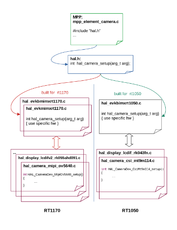

# eIQ MPP Hardware Abstraction Layer API

MPP-HAL VERSION 4.0

## Chapter 1

This is the documentation for the Hardware Abstraction Layer(HAL) API.

### 1.1 HAL overview

The hardware abstraction layer is used to abstract hardware and software components. With the usage of an HAL abstraction, the vision pipeline will be leveraging hardware accelerated components whenever possible.

#### 1.1.1 MPP hal description

The HAL is presented with respect of the following points:

- A common header file "hal.h" includes all hardware top level functions.
- All hardware top level functions are using the prefix: "hal\_ ".
- For each platform all hal\_ functions defined in hal.h should be implemented at least with an empty function.

Here is an overview:

**Figure 1.1 HAL overview**

#### 1.1.2 MPP HAL components
1. **Source elements HAL**
- Camera
- Static image
2. **processing elements HAL**
- Graphics driver
- Vision algorithms
- Labeled rectangle
3. **Sink elements HAL**
- Display

#### 1.1.3 Supported devices

At present, the MPP HAL supports the following devices:

- Cameras:
    * OV5640
    * MT9M114
    * OV7670
    * Logitech C920 PRO HD WEBCAM
- Displays:
    * LVGL
    * RK055AHD091
    * RK055MHD091
    * RK043FN02H-CT
    * Mikroe TFT Proto 5(SSD1963 controller)
    * NXP's LCD-PAR-S035 (ST7796S controller)
    * FBdev
- Graphics:
    * PXP
    * CPU
    * GPU
- JPEG Decoder:
    * JPEG SW
    * JPEG HW
#### 1.1.4 Supported boards

Currently, the MPP HAL supports the following boards:

- (deprecated) evkmimxrt1170 is supported with the following devices:
    * Cameras:  OV5640.
    * Displays: RK055AHD091 and RK055MHD091.

- (deprecated) evkbimxrt1050 is supported with the following devices:
    * Cameras:  MT9M114.
    * Displays: RK043FN02H-CT.

- evkbmimxrt1170 is supported by porting the following devices:
    * Cameras:  OV5640.
    * Displays: LVGL, RK055AHD091 and RK055MHD091.

- frdmmcxn947 is supported by porting the following devices:
    * Cameras:  OV7670.
    * Displays: Mikroe TFT Proto 5" and NXP's LCD-PAR-S035.

- mimxrt700evk is supported by porting the following devices:
    * Cameras:  OV7670, Logitech C920 PRO HD WEBCAM
    * Displays: RK055AHD091 and RK055MHD091.

How to port new boards/devices:
The MPP Hal provides the flexibility to the user to port new boards and devices(cameras and displays).

Supporting new boards:
To support a new board a new file hal\_{board\_name} should be added under the 'hal' directory.

Supporting new devices:
The hal components that can support new devices are:
- Cameras
- Display
- Graphics processing

A new device can simply be supported by:
- Providing the approriate hal\_{device\_module} implementation.
- Adding his name and setup entry point to the appropriate device list in the associated board hal\_{board\_name} file.

Enabling/Disabling Hal components and devices:
- The HAL components can be enabled/disabled from "mpp\_config.h" using the compilation flags(HAL\_ENABLE\_{component\_name}).
- The HAL devices can also be enabled/disabled from "mpp\_config.h" using the compilation flags(HAL\_ENABLE\_{device\_name}).

## Chapter 2

### 2.1 HAL Types

**Data Structures**

- struct[ camera_dev_static_config_t](#camera_dev_static_config_t)
- struct[ camera_dev_private_capability_t](#camera_dev_private_capability_t)
- struct[ camera_dev_t](#camera_dev_t)
- struct[ virtual_usb_cam_config_msg_t](#virtual_usb_cam_config_msg_t)
- struct[ virtual_usb_cam_req_msg_t](#virtual_usb_cam_req_msg_t)
- struct[ virtual_usb_cam_rsp_msg_t](#virtual_usb_cam_rsp_msg_t)
- struct[ virtual_usb_cam_msg_t](#virtual_usb_cam_msg_t)
- struct[ static_image_static_config_t](#static_image_static_config_t)
- struct[ static_image_t](#static_image_t)
- struct[ gfx_surface_t](#gfx_surface_t)
- struct[ gfx_rotate_config_t](#gfx_rotate_config_t)
- struct[ gfx_dev_t](#gfx_dev_t)
- struct[ hal_rect_t](#hal_rect_t)
- struct[ vdec_dev_t](#vdec_dev_t)
- struct[ model_param_t](#model_param_t)
- struct[ valgo_dev_private_capability_t](#valgo_dev_private_capability_t)
- struct[ vision_frame_t](#vision_frame_t)
- struct[ vision_algo_dev_t](#vision_algo_dev_t)
- struct[ display_dev_private_capability_t](#display_dev_private_capability_t)
- struct[ display_dev_t](#display_dev_t)
- struct[ hw_buf_desc_t](#hw_buf_desc_t)
- struct[ hal_img_decoder_setup_t](#hal_img_decoder_setup_t)
- struct[ hal_graphics_setup_t](#hal_graphics_setup_t)
- struct[ hal_display_setup_t](#hal_display_setup_t)
- struct[ hal_camera_setup_t](#hal_camera_setup_t)
- struct[ checksum_data_t](#checksum_data_t)

**Macros**

- #define[ TARGET_CAMERA0_WIDTH](#target_camera0_width)
- #define **TARGET\_CAMERA0\_HEIGHT**
- #define **TARGET\_CAMERA1\_WIDTH**
- #define **TARGET\_CAMERA1\_HEIGHT**
- #define **TARGET\_CAMERA0\_RESOLUTION**
- #define **TARGET\_CAMERA1\_RESOLUTION**
- #define **TARGET\_CAMERA\_MAX\_RESOLUTION**
- #define **TARGET\_CAMERA\_FPS**
- #define **CAMERA\_DEV\_BUFFER\_ALIGN**
- #define[ CORE1_EPT_ADDRESS](#core1_ept_address)
- #define[ MPP_EPT_ADDRESSS](#mpp_ept_addresss)
- #define[ RTSP_EPT_ADDRESS](#rtsp_ept_address)
- #define[ APP_EP_READY_EVENT_DATA](#app_ep_ready_event_data)
- #define[ HAL_GFX_DEV_CPU_NAME](#hal_gfx_dev_cpu_name)
- #define[ GUI_PRINTF_BUF_SIZE](#gui_printf_buf_size)
- #define[ GUI_PRINTF_BUF_SIZE](#gui_printf_buf_size)
- #define[ HAL_VDEC_DEV_NAME](#hal_vdec_dev_name)
- #define[ MAX_INPUT_PORTS](#max_input_ports)
- #define[ MAX_OUTPUT_PORTS](#max_output_ports)
- #define[ HAL_DEVICE_NAME_MAX_LENGTH](#hal_device_name_max_l)

**Typedefs**

- [camera_dev_callback_t)](#camera_dev_callback_t)
- [vision_algo_private_data_t]
- [mpp_callback_t)](#mpp_callback_t)
- [img_decoder_setup_func_t)](#img_decoder_setup_func_t)
- [graphic_setup_func_t)](#graphic_setup_func_t)
- [display_setup_func_t)](#display_setup_func_t)
- [camera_setup_func_t)](#camera_setup_func_t)

**Enumerations**

- enum [hal_camera_status_t](#hal_camera_status_t) {

  [kStatus_HAL_CameraSuccess](#kstatus_hal_camerasuccess),

  [kStatus_HAL_CameraBusy](#kstatus_hal_camerabusy),

  [kStatus_HAL_CameraNoData](#kstatus_hal_cameranodata),

  [kStatus_HAL_CameraNonBlocking](#kstatus_hal_cameranonblocking),

  [kStatus_HAL_CameraError](#kstatus_hal_cameraerror)

}

- enum [camera_event_t](#camera_event_t) {

  [kCameraEvent_SendFrame](#kcameraevent_sendframe),

  [kCameraEvent_CameraDeviceInit](#kcameraevent_cameradeviceinit)

}

- enum[ virtual_usb_cam_msg_type_e ](#virtual_usb_cam_msg_type_e){

  **VIRT\_USB\_CAM\_NOMSG** ,

  **VIRT\_USB\_CAM\_CONFIG**,

  **VIRT\_USB\_CAM\_CONFIG\_ACK**, **VIRT\_USB\_CAM\_CONFIG\_ERR** ,

  **VIRT\_USB\_CAM\_REQRGB** ,

  **VIRT\_USB\_CAM\_REQIR**,

  **VIRT\_USB\_CAM\_REQRGBIR** ,

  **VIRT\_USB\_CAM\_RSPRGB** ,

  **VIRT\_USB\_CAM\_RSPIR** ,

  **VIRT\_USB\_CAM\_RSPRGBIR** ,

  **VIRT\_USB\_CAM\_ERROR** }

- enum **virtual\_usb\_cam\_user\_id\_e** {

  **RTSP\_USER\_ID** ,

  **MPP\_USER\_ID** }

- enum[ virtual_usb_cam_col_format_e ](#virtual_usb_cam_col_format_e){ **VIRT\_USB\_CAM\_JPEG** }

- enum [hal_image_status_t](#hal_image_status_t) {

  [MPP_kStatus_HAL_ImageSuccess](#mpp_kstatus_hal_imagesuccess),

  [MPP_kStatus_HAL_ImageError](#mpp_kstatus_hal_imageerror)

}

- enum [gfx_rotate_target_t](#gfx_rotate_target_t) {

  kGFXRotateTarget_None,

  kGFXRotate_SRCSurface,

  kGFXRotate_DSTSurface

}

- enum [hal_valgo_status_t](#hal_valgo_status_t) {

  [kStatus_HAL_ValgoSuccess](#kstatus_hal_valgosuccess),

  [kStatus_HAL_ValgoMallocError](#kstatus_hal_valgomallocerror),

  [kStatus_HAL_ValgoInitError](#kstatus_hal_valgoiniterror),

  [kStatus_HAL_ValgoError](#kstatus_hal_valgoerror),

  [kStatus_HAL_ValgoStop](#kstatus_hal_valgostop)

}

- enum [display_event_t](#display_event_t) {

  [kDisplayEvent_RequestFrame](#kdisplayevent_requestframe)

}

- enum [hal_display_status_t](#hal_display_status_t) {

  [kStatus_HAL_DisplaySuccess](#kstatus_hal_displaysuccess),

  [kStatus_HAL_DisplayTxBusy](#kstatus_hal_displaytxbusy),

  [kStatus_HAL_DisplayNonBlocking](#kstatus_hal_displaynonblocking),

  [kStatus_HAL_DisplayError](#kstatus_hal_displayerror)

}

- enum [mpp_memory_policy_t](#mpp_memory_policy_t) {

  [HAL_MEM_ALLOC_NONE](#hal_mem_alloc_none),

  [HAL_MEM_ALLOC_INPUT](#hal_mem_alloc_input),

  [HAL_MEM_ALLOC_OUTPUT](#hal_mem_alloc_output),

  [HAL_MEM_ALLOC_BOTH](#hal_mem_alloc_both)

}

- enum [checksum_type_t](#checksum_type_t) {

  [CHECKSUM_TYPE_PISANO](#checksum_type_pisano),

  [CHECKSUM_TYPE_CRC_ELCDIF](#checksum_type_crc_elcdif)

}

**Functions**

- int[ HAL_GfxDev_CPU_Register ](#hal_gfxdev_cpu_register)(gfx\_dev\_t ∗dev)
- int[ HAL_GfxDev_GPU_Register ](#hal_gfxdev_gpu_register)(gfx\_dev\_t ∗dev)
- int[ HAL_JPEG_CPU_Register ](#hal_jpeg_cpu_register)(vdec\_dev\_t ∗dev)
- int[ HAL_JPEG_HW_Register ](#hal_jpeg_hw_register)(vdec\_dev\_t ∗dev)
- int **setup\_static\_image\_elt** (static\_image\_t ∗elt)
- uint32\_t **calc\_checksum** (int size\_b, void ∗pbuf)

#### 2.1.1 Detailed Description

This section provides the detailed documentation for the MPP HAL types.

##### 2.1.1.1 Data Structure Documentation

##### camera_dev_static_config_t

**struct camera\_dev\_static\_config\_t**

Structure that characterizes the camera device.

**Data Fields**

|type|name|description|
|---|---|---|
|int|height|buffer height|
|int|width|buffer width|
|int|pitch|buffer pitch|
|int|left|left position|
|int|top|top position|
|int|right|right position|
|int|bottom|bottom position|
|mpp\_rotate\_degree\_t|rotate|rotate degree|
|mpp\_flip\_mode\_t|flip|flip|
|int|swapByte|swap byte per two bytes|
|mpp\_pixel\_format\_t|format|pixel format|
|int|framerate|frame rate|
|int|stripe\_size|stripe size in bytes|
|bool|stripe|stripe mode|
|uint32\_t|n\_streams|number of total output video streams|
|uint32\_t|min\_stream\_req\_cnt|minimum number of enqueue calls to wait for|
|uint32\_t|crt\_stream\_req\_cnt|number of streams requested for enqueue|
|mpp\_exec\_flag\_t|req\_cnt\_type|flag to control stream request counting|
|mpp\_camera\_stream\_cfg|stream[NUM\_STREAMS]|stream configuration|
|bool|stream\_requested[NUM\_STREAMS]|flag to track if a stream is required for enqueue|
|bool|in\_advance\_enqueue|flag to indicate advance enqueue mode|

##### camera_dev_private_capability_t

**struct camera\_dev\_private\_capability\_t**

Camera device private capability.

**Data Fields**

|type|name|description|
|-|-|-|
|[camera_dev_callback_t](#camera_dev_callback_t)|callback|callback|
|void ∗|param|parameter for the callback|

##### camera_dev

**struct \_camera\_dev**

Camera devices can enqueue and dequeue frames as well as react to events from input devices via the "input← Notify" function. Camera devices can use any number of interfaces, including MIPI and CSI as long as the HAL driver implements the necessary functions found in[ camera_dev_operator_t.](#camera_dev_operator_t) Examples of camera devices include the Orbbec U1S 3D SLM camera module and the OnSemi MT9M114 camera module.

**Data Fields**

|int|id|unique id which is assigned by camera manager during registration|
| - | - | :- |
|char|name[[HAL_DEVICE_NAME_MAX_L](#hal_device_name_max_l)|[ENGTHname of\]] the device|
|const[ camera_dev_operator_t ](#camera_dev_operator_t)∗|ops|operations|
|[camera_dev_static_config_t](#camera_dev_static_config_t)|config|static configurations|
|[camera_dev_private_capability_t](#camera_dev_private_capability_t)|cap|private capability|
|void ∗|data|device private data|

##### virtual_usb_cam_config_msg_t

**struct virtual\_usb\_cam\_config\_msg\_t**

Structure that characterizes the payload of the camera config message sent from core 0 to core 1.

**Data Fields**

|type|name|description|
| - | - | - |
|uint32\_t|camera\_width|Width of the camera output in pixels.|
|uint32\_t|camera\_height|Height of the camera output in pixels.|
|[virtual_usb_cam_col_format_e](#virtual_usb_cam_col_format_e)|color\_format|Color format for the camera output (e.g., JPEG)|
|uint32\_t|fps|Frames per second for camera capture rate.|

##### virtual_usb_cam_req_msg_t

**struct virtual\_usb\_cam\_req\_msg\_t**

Structure that characterizes the payload of the camera request message containing frame buffer addresses for RGB and IR data.

**Data Fields**

|type|name|description|
| - | - | - |
|uint32\_t|rgb\_frame\_addr|Physical address of the RGB frame buffer.|
|uint32\_t|rgb\_max\_frame\_size|Maximum size allocated for RGB frame buffer.|
|uint32\_t|ir\_frame\_addr|Physical address of the IR frame buffer.|
|uint32\_t|ir\_max\_frame\_size|Maximum size allocated for IR frame buffer.|

##### virtual_usb_cam_rsp_msg_t

**struct virtual\_usb\_cam\_rsp\_msg\_t**

Structure that characterizes the payload of the camera request message containing frame addresses and sizes for RGB and IR data.

**Data Fields**

|type|name|description|
| - | - | - |
|uint32\_t|rgb\_frame\_addr|Physical address of the RGB frame buffer (looped back by the core 1 camera app)|
|uint32\_t|rgb\_frame\_size|Size in bytes of the RGB frame data.|
|uint32\_t|ir\_frame\_addr|Physical address of the IR frame buffer (looped back by the core 1 camera app)|
|uint32\_t|ir\_frame\_size|Size in bytes of the IR frame data.|

##### virtual_usb_cam_msg_t

**struct virtual\_usb\_cam\_msg\_t**

Structure that characterizes the messages sent between cores.

**Data Fields**

|type|name|description|
| - | - | - |
|[virtual_usb_cam_msg_type_e](#virtual_usb_cam_msg_type_e)|msg\_type|Type of message being sent (config, request, response, etc.)|
|virtual\_usb\_cam\_user\_id\_e|user\_id|Identifier for the user/component sending the message (RTSP or MPP)|
|union[ msg_payload_u](#msg_payload_u)|msg\_payload|Union containing the actual message data based on msg\_type.|

##### static_image_static_config_t

**struct static\_image\_static\_config\_t**

Structure that characterizes the image element.

**Data Fields**
|type|name|description|
|---|---|---|
|int|height|buffer height|
|int|width|buffer width|
|int|left|left position|
|int|top|top position|
|int|right|right position|
|int|bottom|bottom position|
|mpp\_pixel\_format\_t|format|pixel format|
|bool|stripe|stripe mode|
|int|compressed\_size|compressed size in bytes|

##### static_image

**struct \_static\_image**

Attributes of an image element.

**Data Fields**

|type|name|description|
|---|---|---|
|int|id|unique id which is assigned by image manager|
|const[ static_image_operator_t ](#static_image_operator_t)∗|ops|operations|
|[static_image_static_config_t](#static_image_static_config_t)|config|static configs|
|int|stripe\_idx|the current stripe index|
|uint8\_t ∗|buffer|static image buffer|

##### gfx_surface_t

**struct gfx\_surface\_t**

Gfx surface parameters.

**Data Fields**

|type|name|description|
|---|---|---|
|int|height|buffer height|
|int|width|buffer width|
|int|pitch|buffer pitch|
|int|left|left position|
|int|top|top position|
|int|right|right position|
|int|bottom|bottom position|
|int|swapByte|swap byte per two bytes|
|mpp\_pixel\_format\_t|format|pixel format|
|void ∗|buf|buffer|
|void ∗|lock|the structure is determined by hal and set to null if not use in hal|

##### gfx_rotate_config_t

**struct gfx\_rotate\_config\_t**

gfx rotate configuration.

**Data Fields**

|type|name|description|
|---|---|---|
|gfx\_rotate\_target\_t|target||
|mpp\_rotate\_degree\_t|degree||

##### gfx_dev

**struct \_gfx\_dev**

**Data Fields**

|type|name|description|
|---|---|---|
|int|id||
|const[ gfx_dev_operator_t ](#gfx_dev_operator_t)|ops||
|[gfx_surface_t](#gfx_surface_t)|src||
|[gfx_surface_t](#gfx_surface_t)|dst||
|[mpp_callback_t](#mpp_callback_t)|callback||
|void ∗|user\_data||

##### hal_rect_t

**struct hal\_rect\_t**

rectangle positions.

**Data Fields**

|type|name|description|
|---|---|---|
|int|top||
|int|left||
|int|bottom||
|int|right||

##### vdec_dev_t

**struct \_vdec\_dev**

**Data Fields**

|type|name|description|
|---|---|---|
|int|id||
|const[ vdec_dev_operator_t ](#vdec_dev_operator_t)∗|ops||
|[mpp_callback_t](#mpp_callback_t)|callback||
|void ∗|user\_data||

##### model_param_t

**struct model\_param\_t**

Structure passed to HAL as description of the binary model provided by user.

**Data Fields**

- const void ∗[model_data](#model_data)
- int[ model_size](#model_size)
- float[ model_input_mean](#model_input_mean)
- float[ model_input_std](#model_input_std)
- mpp\_inference\_params\_t[ inference_params](#inference_params)
- int[ height](#height)
- int[ width](#width)
- mpp\_pixel\_format\_t[ format](#format)
- mpp\_tensor\_type\_t[ inputType](#inputtype)
- mpp\_tensor\_order\_t[ tensor_order](#tensor_order)
- mpp\_t[ mpp](#mpp)
- int(∗[evt_callback_f ](#evt_callback_f))(mpp\_t mpp, mpp\_evt\_t evt, void ∗evt\_data, void ∗user\_data)
- void ∗[cb_userdata](#cb_userdata)

**Field Documentation**

##### model_data

const void∗ model\_param\_t::model\_data pointer to model binary

##### model_size

int model\_param\_t::model\_size model binary size

##### model_input_mean

float model\_param\_t::model\_input\_mean

model 'mean' of input values, used for normalization

##### model_input_std

float model\_param\_t::model\_input\_std

model 'standard deviation' of input values, used for normalization

##### inference_params

mpp\_inference\_params\_t model\_param\_t::inference\_params inference parameters

##### height

int model\_param\_t::height frame height

##### width

int model\_param\_t::width frame width

##### format

mpp\_pixel\_format\_t model\_param\_t::format pixel format

##### inputtype

mpp\_tensor\_type\_t model\_param\_t::inputType input type

##### tensor_order

mpp\_tensor\_order\_t model\_param\_t::tensor\_order tensor order

##### mpp

 mpp\_t model\_param\_t::mpp mpp handle

##### evt_callback_f

int(∗ model\_param\_t::evt\_callback\_f) (mpp\_t mpp, mpp\_evt\_t evt, void ∗evt\_data, void ∗user\_data)

the callback to be called when model output is ready

##### cb_userdata

void∗ model\_param\_t::cb\_userdata

pointer to user data, should be passed by callback

##### valgo_dev_private_capability_t

**struct valgo\_dev\_private\_capability\_t**

Valgo devices private capability.

**Data Fields**

|type|name|description|
|-|-|-|
|void ∗|param|param for the callback|

##### vision_frame_t

**struct vision\_frame\_t**

Characteristics that need to be defined by a vision algo.

**Data Fields**

|type|name|description|
|-|-|-|
|int|height|frame height|
|int|width|frame width|
|int|pitch|frame pitch|
|mpp\_pixel\_format\_t|format|pixel format|
|void ∗|input\_buf|pixel input buffer|

##### vision_algo_dev_t

**struct \_vision\_algo\_dev**

Attributes of a vision algo device.

**Data Fields**

|type|name|description|
|-|-|-|
|int|id|unique id which is assigned by algorithm manager during the registration|
|char|name[[HAL_DEVICE_NAME_MAX_L](#hal_device_name_max_l)|[ENGTHname to\]] identify|
|[valgo_dev_private_capability_t](#valgo_dev_private_capability_t)|cap|private capability|
|
const[ vision_algo_dev_operator_t](#vision_algo_dev_operator_t)

∗
|ops|operations|
|vision\_algo\_private\_data\_t|priv\_data|private data|

##### display_dev_private_capability_t

**struct display\_dev\_private\_capability**

Structure that characterizes the display device.

**Data Fields**

|type|name|description|
|-|-|-|
|int|height|buffer height|
|int|width|buffer width|
|int|pitch|buffer pitch|
|int|left|left position|
|int|top|top position|
|int|right|right position|
|int|bottom|bottom position|
|int|stripe\_height|stripe height (0 if stripe mode is off)|
|bool|stripe|stripe mode|
|mpp\_rotate\_degree\_t|rotate|rotate degree|
|mpp\_pixel\_format\_t|format|pixel format|
|int|nbFrameBuffer|number of input buffers|
|void ∗∗|frameBuffers|array of pointers to frame buffer|
|[mpp_callback_t](#mpp_callback_t)|callback|callback|
|void ∗|user\_data|parameter for the callback|
|void ∗|handle|Handle to the LVGL widget 'image'.|
|void ∗∗|p\_in\_buf\_addr|Pointer to current input buffer address.|

##### display_dev_t

**struct display\_dev\_t**

Attributes of a display device. hal display device declaration.

Display devices can be used to display images, GUI overlays, etc. Examples of display devices include display panels like the RK024hh298 display, and external displays like UVC (video over USB).

**Data Fields**

|type|name|description|
|-|-|-|
|int|id|unique id which is assigned by the display manager during the registration|
|char|name[[HAL_DEVICE_NAME_MAX_L](#hal_device_name_max_l)|[ENGTHname of\]] the device|
|const[ display_dev_operator_t ](#display_dev_operator_t)∗|ops|operations|
|display\_dev\_private\_capability\_t|cap|private capability|

##### hw_buf_desc_t

**struct hw\_buf\_desc\_t**

the hardware specific buffer requirements

**Data Fields**

|type|name|description|
|-|-|-|
|int|stride|the number of bytes between 2 lines of image|
|int|nb\_lines|the number of lines required (set to 0 if the element doesn't require a specific number of lines)|
|int|alignment|alignment requirement in bytes|
|int|max\_image\_size|the number of bytes allocated|
|bool|cacheable|if true, HW will require cache maintenance|
|unsigned char ∗|addr|the aligned buffer address|
|unsigned char ∗|heap\_p|pointer to the heap that should be freed|

##### hal_img_decoder_setup_t

**struct hal\_img\_decoder\_setup\_t**

**Data Fields**

|type|name|description|
|-|-|-|
|const char ∗|vdec\_dev\_name||
|[img_decoder_setup_func_t](#img_decoder_setup_func_t)|decoder\_setup\_func||

##### hal_graphics_setup_t

**struct hal\_graphics\_setup\_t**

**Data Fields**

|type|name|description|
|-|-|-|
|const char ∗|gfx\_dev\_name||
|[graphic_setup_func_t](#graphic_setup_func_t)|gfx\_setup\_func||

##### hal_display_setup_t

**struct hal\_display\_setup\_t**

**Data Fields**

|type|name|description|
|-|-|-|
|const char ∗|display\_name||
|[display_setup_func_t](#display_setup_func_t)|display\_setup\_func||

##### hal_camera_setup_t

**struct hal\_camera\_setup\_t**

**Data Fields**

|type|name|description|
|-|-|-|
|const char ∗|camera\_name||
|[camera_setup_func_t](#camera_setup_func_t)|camera\_setup\_func||

##### checksum_data_t

**struct checksum\_data\_t**

computed checksum

**Data Fields**

|type|name|description|
|-|-|-|
|[checksum_type_t](#checksum_type_t)|type|checksum calculation method|
|uint32\_t|value|checksum value|

##### 2.1.1.2 Macro Definition Documentation

##### target_camera0_width

#define TARGET\_CAMERA0\_WIDTH

Buffer alignment requirement for camera device buffers in bytes.

##### core1_ept_address

**CORE1\_EPT\_ADDRESS**

#define CORE1\_EPT\_ADDRESS

Endpoint address for Core 1 inter-core communication channel.

##### mpp_ept_addresss

**MPP\_EPT\_ADDRESSS**

#define MPP\_EPT\_ADDRESSS

Endpoint address for MPP (Media Processing Pipeline) inter-core communication channel. MPP might use a range of endpoints starting with 40 and up to 49 included

##### rtsp_ept_address

**RTSP\_EPT\_ADDRESS**

#define RTSP\_EPT\_ADDRESS

Endpoint address for RTSP (Real Time Streaming Protocol) inter-core communication channel.

##### app_ep_ready_event_data

**APP\_EP\_READY\_EVENT\_DATA**

#define APP\_EP\_READY\_EVENT\_DATA

Event data value indicating that the application endpoint is ready for communication.

##### hal_gfx_dev_cpu_name

**HAL\_GFX\_DEV\_CPU\_NAME**

#define HAL\_GFX\_DEV\_CPU\_NAME

hal graphics (gfx) device declaration.

Graphics processing devices can be used to perform conversion from one image format to another, resize images and compose images on top of one another. Examples of graphics devices include the PXP (pixel pipeline) found on many i.MXRT series MCUs. Name of the graphic device using CPU operations

##### gui_printf_buf_size

**GUI\_PRINTF\_BUF\_SIZE**

#define GUI\_PRINTF\_BUF\_SIZE

Local text buffer size.

##### hal_vdec_dev_name

**HAL\_VDEC\_DEV\_NAME**

#define HAL\_VDEC\_DEV\_NAME

hal video decoder (vdec) device declaration.

Video decoder devices can be used to perform decompression of image. Examples of decoder devices include the PNG/JPEG HW or SW found on many i.MXRT series MCUs. Name of the jpeg decoder device using CPU operations

##### max_input_ports

**MAX\_INPUT\_PORTS**

#define MAX\_INPUT\_PORTS

maximum number of element inputs/outputs

##### hal_device_name_max_length

**HAL\_DEVICE\_NAME\_MAX\_LENGTH**

#define HAL\_DEVICE\_NAME\_MAX\_LENGTH

maximum length of device name

##### 2.1.1.3 Typedef Documentation

##### camera_dev_callback_t

typedef int(∗ camera\_dev\_callback\_t) (const camera\_dev\_t ∗dev, [camera_event_t](#camera_event_t) event, void ∗param, uint8\_t fromISR)

Callback function to notify camera manager that one frame is dequeued.

**Parameters**

|name|description|
|-|-|
|dev|Device structure of the camera device calling this function|
|event|id of the event that took place|
|param|Parameters|
|fromISR|True if this operation takes place in an irq, 0 otherwise|

**Returns**

0 if the operation was successfully

##### mpp_callback_t

typedef int(∗ mpp\_callback\_t) (mpp\_t mpp, mpp\_evt\_t evt, void ∗evt\_data, void ∗user\_data) The mpp callback function prototype.

##### img_decoder_setup_func_t

typedef int(∗ img\_decoder\_setup\_func\_t) (vdec\_dev\_t ∗) video decoder setup

##### graphic_setup_func_t

typedef int(∗ graphic\_setup\_func\_t) (gfx\_dev\_t ∗) graphics setup

##### display_setup_func_t

typedef int(∗ display\_setup\_func\_t) (display\_dev\_t ∗) display setup

##### camera_setup_func_t

typedef int(∗ camera\_setup\_func\_t) (const char ∗, camera\_dev\_t ∗) camera setup

##### 2.1.1.4 Enumeration Type Documentation

##### hal_camera_status_t

enum [hal_camera_status_t ](#hal_camera_status_t)Camera return status.

**Enumerator**

|label|description|
|-|-|
|kStatus\_HAL\_CameraSuccess|HAL camera successful.|
|kStatus\_HAL\_CameraBusy|Camera is busy.|
|kStatus\_HAL\_CameraNoData|No data available from camera.|
|kStatus\_HAL\_CameraNonBlocking|Camera will return immediately.|
|kStatus\_HAL\_CameraError|Error occurs on HAL Camera.|

##### camera_event_t

enum [camera_event_t](#camera_event_t)

Type of events that are supported by calling the callback function.

**Enumerator**

|label|description|
|-|-|
|kCameraEvent\_SendFrame|Camera new frame is available.|
|kCameraEvent\_CameraDeviceInit|Camera device finished the initialization process.|

**Enumeration Type Documentation**

##### virtual_usb_cam_msg_type_e

enum [virtual_usb_cam_msg_type_e](#virtual_usb_cam_msg_type_e)

Structure that characterizes the exchanged message types between core 0 and core 1.

##### virtual_usb_cam_col_format_e

enum [virtual_usb_cam_col_format_e](#virtual_usb_cam_col_format_e)

Structure that characterizes the color format for the camera output.

##### hal_image_status_t

enum [hal_image_status_t ](#hal_image_status_t)static image return status

**Enumerator**

|label|description|
| -| - |
|MPP\_kStatus\_HAL\_ImageSuccess|Successfully.|
|MPP\_kStatus\_HAL\_ImageError|Error occurs on HAL Image.|

##### gfx_rotate_target_t

enum [gfx_rotate_target_t ](#gfx_rotate_target_t)gfx rotate target

##### hal_valgo_status_t

enum [hal_valgo_status_t](#hal_valgo_status_t)

Valgo Error codes for hal operations.

**Enumerator**

|label|description|
|-|-|
|kStatus\_HAL\_ValgoSuccess|Successfully.|
|kStatus\_HAL\_ValgoMallocError|memory allocation failed for HAL algorithm|
|kStatus\_HAL\_ValgoInitError|algorithm initialization error|
|kStatus\_HAL\_ValgoError|Error occurs in HAL algorithm.|
|kStatus\_HAL\_ValgoStop|HAL algorithm stop.|

##### display_event_t

enum [display_event_t](#display_event_t)

Type of events that are supported by calling the callback function.

**Enumerator**

|label|description|
|-|-|
|kDisplayEvent\_RequestFrame|Display finished sending the frame asynchronously, provide another frame.|

##### hal_display_status_t

enum [hal_display_status_t ](#hal_display_status_t)Error codes for display hal devices.

**Enumerator**

|label|description|
|-|-|
|kStatus\_HAL\_DisplaySuccess|HAL display successful.|
|kStatus\_HAL\_DisplayTxBusy|Display tx is busy.|
|kStatus\_HAL\_DisplayNonBlocking|Display will return immediately.|
|kStatus\_HAL\_DisplayError|Error occurs on HAL Display.|

##### mpp_memory_policy_t

enum [mpp_memory_policy_t](#mpp_memory_policy_t)

The memory allocation policy of an element's hal.

During the pipeline construction, the HAL uses this enum to tell the pipeline if it already owns input/ouput buffers. Before the pipeline starts, the memory manager will map the existing buffers to elements and allocate missing buffers from the heap.

**Enumerator**

|label|description|
|-|-|
|HAL\_MEM\_ALLOC\_NONE|element requires buffers to be provided by other elements, or by the pipeline|
|HAL\_MEM\_ALLOC\_INPUT|element allocates its input buffer, it may require output buffers to be provided by other elements, or by the pipeline|
|HAL\_MEM\_ALLOC\_OUTPUT|element allocates its output buffer, it may require input buffers to be provided by other elements, or by the pipeline|
|HAL\_MEM\_ALLOC\_BOTH|element allocates both its input and output buffers|

##### checksum_type_t

enum [checksum_type_t ](#checksum_type_t)checksum calculation method

**Enumerator**

|label|description|
|-|-|
|CHECKSUM\_TYPE\_PISANO|checksum computed using Pisano|
|CHECKSUM\_TYPE\_CRC\_ELCDIF|checksum computed CRC from ELCDIF|

##### 2.1.1.5 Function Documentation

**HAL\_GfxDev\_CPU\_Register()**

int HAL\_GfxDev\_CPU\_Register ( gfx\_dev\_t ∗ dev )

Register the graphic device with the CPU operations.

**Parameters**

|in/out|name|description|
|-|-|-|
|in|dev|graphic device to register|

**Returns**

error code (0: success, otherwise: failure)

**HAL\_GfxDev\_GPU\_Register()**

int HAL\_GfxDev\_GPU\_Register ( gfx\_dev\_t ∗ dev )

Register the graphic device with the GPU operations.

**Parameters**

|in/out|name|description|
|-|-|-|
|in|dev|graphic device to register|

**Returns**

error code (0: success, otherwise: failure)

**HAL\_JPEG\_CPU\_Register()**

int HAL\_JPEG\_CPU\_Register ( vdec\_dev\_t ∗ dev )

Register the jpeg SW decoder device.

**Parameters**

|in/out|name|description|
|-|-|-|
|in|dev|decoder device to register|

**Returns**

error code (0: success, otherwise: failure)

**HAL\_JPEG\_HW\_Register()**

int HAL\_JPEG\_HW\_Register ( vdec\_dev\_t ∗ dev )

Register the jpeg HW decoder device.

**Parameters**

|in/out|name|description|
|-|-|-|
|in|dev|decoder device to register|

**Returns**

error code (0: success, otherwise: failure)

### 2.2 HAL OPERATIONS

**Data Structures**

- struct[ camera_dev_operator_t](#camera_dev_operator_t)
- struct[ static_image_operator_t](#static_image_operator_t)
- struct[ gfx_dev_operator_t](#gfx_dev_operator_t)
- struct[ vdec_dev_operator_t](#vdec_dev_operator_t)
- struct[ vision_algo_dev_operator_t](#vision_algo_dev_operator_t)
- struct[ display_dev_operator_t](#display_dev_operator_t)

**Typedefs**

- typedef int(∗[mpp_callback_t)](#mpp_callback_t) (mpp\_t mpp, mpp\_evt\_t evt, void ∗evt\_data, void ∗user\_data)

**Functions**

- void[ GUI_DrawText ](#gui_drawtext)(uint16\_t ∗lcd\_buf, uint16\_t fcolor, uint16\_t bcolor, uint32\_t width, int x, int y, const char ∗label)
- static void[ hal_draw_pixel565 ](#hal_draw_pixel565)(uint16\_t ∗pDst, uint32\_t x, uint32\_t y, uint16\_t color, uint32\_t lcd\_w)
- static void[ hal_draw_text565 ](#hal_draw_text565)(uint16\_t ∗lcd\_buf, uint16\_t fcolor, uint16\_t bcolor, uint32\_t width, int x, int y, const char ∗label, int stripe\_top, int stripe\_bottom)
- static void[ hal_draw_rect565 ](#hal_draw_rect565)(uint16\_t ∗lcd\_buf,[ hal_rect_t ](#hal_rect_t)rect, mpp\_color\_t rgb, uint32\_t width, int stripe← \_top, int stripe\_bottom)
- static int[ get_bitpp ](#get_bitpp)(mpp\_pixel\_format\_t type)
- void[ swap_2_bytes ](#swap_2_bytes)(uint8\_t ∗data, int size)

#### 2.2.1 Detailed Description

This section provides the detailed documentation for the MPP HAL operations that needs to be implemented for each component.

##### 2.2.1.1 Data Structure Documentation

##### camera_dev_operator_t

**struct camera\_dev\_operator\_t**

Operation that needs to be implemented by a camera device.

**Data Fields**

- [hal_camera_status_t(](#hal_camera_status_t)∗[init ](#init))(camera\_dev\_t ∗dev, mpp\_camera\_params\_t ∗config,[ camera_dev_callback_t ](#camera_dev_callback_t)callback, void ∗param)
- [hal_camera_status_t(](#hal_camera_status_t)∗[deinit ](#deinit))(camera\_dev\_t ∗dev)
- [hal_camera_status_t(](#hal_camera_status_t)∗[start ](#start))(const camera\_dev\_t ∗dev)
- [hal_camera_status_t(](#hal_camera_status_t)∗[stop ](#stop))(const camera\_dev\_t ∗dev)
- [hal_camera_status_t(](#hal_camera_status_t)∗[enqueue ](#enqueue))(const camera\_dev\_t ∗dev, void ∗data)
- [hal_camera_status_t(](#hal_camera_status_t)∗[dequeue ](#dequeue))(const camera\_dev\_t ∗dev, void ∗∗data, int ∗stripe, int ∗compressed\_size)
- [hal_camera_status_t(](#hal_camera_status_t)∗[get_buf_desc ](#get_buf_desc))(const camera\_dev\_t ∗dev,[ hw_buf_desc_t ](#hw_buf_desc_t)∗out\_buf,[ mpp_memory_policy_t ](#mpp_memory_policy_t)∗policy)
- [hal_camera_status_t(](#hal_camera_status_t)∗[lock ](#lock))(const camera\_dev\_t ∗dev)
- [hal_camera_status_t(](#hal_camera_status_t)∗[unlock ](#unlock))(const camera\_dev\_t ∗dev)

**Field Documentation**

##### init

**init**

[hal_camera_status_t](#hal_camera_status_t)(∗ camera\_dev\_operator\_t::init) (camera\_dev\_t ∗dev, mpp\_camera\_params\_t ∗config, [camera_dev_callback_t](#camera_dev_callback_t) callback, void ∗param)

initialize the dev

##### deinit

**deinit**

[hal_camera_status_t](#hal_camera_status_t)(∗ camera\_dev\_operator\_t::deinit) (camera\_dev\_t ∗dev)

deinitialize the dev

##### start

**start**

[hal_camera_status_t](#hal_camera_status_t)(∗ camera\_dev\_operator\_t::start) (const camera\_dev\_t ∗dev)

start the dev

##### stop

**stop**

[hal_camera_status_t](#hal_camera_status_t)(∗ camera\_dev\_operator\_t::stop) (const camera\_dev\_t ∗dev)

stop the dev

##### enqueue

**enqueue**

[hal_camera_status_t(∗ ](#hal_camera_status_t)camera\_dev\_operator\_t::enqueue) (const camera\_dev\_t ∗dev, void ∗data) enqueue a buffer to the dev

##### dequeue

**dequeue**

[hal_camera_status_t(∗ ](#hal_camera_status_t)camera\_dev\_operator\_t::dequeue) (const camera\_dev\_t ∗dev, void ∗∗data, int ∗stripe)

dequeue a buffer from the dev (blocking)

##### get_buf_desc

**get\_buf\_desc**

[hal_camera_status_t(∗ ](#hal_camera_status_t)camera\_dev\_operator\_t::get\_buf\_desc) (const camera\_dev\_t ∗dev, [hw_buf_desc_t ](#hw_buf_desc_t)∗out\_buf, [mpp_memory_policy_t ](#mpp_memory_policy_t)∗policy)

get buffer descriptors and policy

##### lock

**lock**

[hal_camera_status_t](#hal_camera_status_t)(∗ camera\_dev\_operator\_t::lock) (const camera\_dev\_t ∗dev)

lock the device for exclusive access and operations

##### unlock

[hal_camera_status_t](#hal_camera_status_t)(∗ camera\_dev\_operator\_t::unlock) (const camera\_dev\_← t ∗dev)

unlock the device after exclusive operations

##### static_image_operator_t

**struct static\_image\_operator\_t**

Operation that needs to be implemented by an image element.

**Data Fields**

- [hal_image_status_t(](#hal_image_status_t)∗[init ](#init))(static\_image\_t ∗elt, mpp\_img\_params\_t ∗config, void ∗param)
- [hal_image_status_t(](#hal_image_status_t)∗[dequeue ](#dequeue))(static\_image\_t ∗elt,[ hw_buf_desc_t ](#hw_buf_desc_t)∗out\_buf, int ∗stripe\_num)

##### init

**init**

[hal_image_status_t](#hal_image_status_t)(∗ static\_image\_operator\_t::init) (static\_image\_t ∗elt, mpp← \_img\_params\_t ∗config, void ∗param)

   initialize the elt

##### dequeue

**dequeue**

[hal_image_status_t](#hal_image_status_t)(∗ static\_image\_operator\_t::dequeue) (static\_image\_← t ∗elt, [hw_buf_desc_t](#hw_buf_desc_t) ∗out\_buf, int ∗stripe\_num)

   dequeue a buffer from the elt

##### gfx_dev_operator_t

**struct gfx\_dev\_operator\_t**

Operation that needs to be implemented by gfx device.

**Data Fields**

- int(∗**init** )(gfx\_dev\_t ∗dev, void ∗param)
- int(∗**deinit** )(gfx\_dev\_t ∗dev)
- int(∗**get\_buf\_desc** )(const gfx\_dev\_t ∗dev, [hw_buf_desc_t](#hw_buf_desc_t) ∗in\_buf, [hw_buf_desc_t](#hw_buf_desc_t) ∗out\_buf, [mpp_memory_policy_t ](#mpp_memory_policy_t)∗policy)
- int(∗**blit** )(const gfx\_dev\_t ∗dev, const [gfx_surface_t](#gfx_surface_t) ∗pSrc, const [gfx_surface_t](#gfx_surface_t) ∗pDst, const [gfx_rotate_config_t ](#gfx_rotate_config_t)∗pRotate, mpp\_flip\_mode\_t flip)
- int(∗**drawRect** )(const gfx\_dev\_t ∗dev,[ gfx_surface_t ](#gfx_surface_t)∗pOverlay, int x, int y, int w, int h, int color)
- int(∗**drawPicture** )(const gfx\_dev\_t ∗dev,[ gfx_surface_t ](#gfx_surface_t)∗pOverlay, int x, int y, int w, int h, int alpha, const char ∗pIcon)
- int(∗**drawText** )(const gfx\_dev\_t ∗dev,[ gfx_surface_t ](#gfx_surface_t)∗pOverlay, int x, int y, int textColor, int bgColor, int type, const char ∗pText)
- int(∗**compose** )(const gfx\_dev\_t ∗dev,[ gfx_surface_t ](#gfx_surface_t)∗pSrc,[ gfx_surface_t ](#gfx_surface_t)∗pOverlay,[ gfx_surface_t ](#gfx_surface_t)∗pDst, [gfx_rotate_config_t ](#gfx_rotate_config_t)∗pRotate, mpp\_flip\_mode\_t flip)
- int(∗**finish** )(gfx\_dev\_t ∗dev)

##### vdec_dev_operator_t

**struct vdec\_dev\_operator\_t**

Operation that needs to be implemented by vdec device.

**Data Fields**

- int(∗**init** )(vdec\_dev\_t ∗dev, void ∗param)
- int(∗**deinit** )(const vdec\_dev\_t ∗dev)
- int(∗ **get\_buf\_desc** )(const vdec\_dev\_t ∗dev, [hw_buf_desc_t](#hw_buf_desc_t) ∗in\_buf, [hw_buf_desc_t](#hw_buf_desc_t) ∗out\_buf, [mpp_memory_policy_t ](#mpp_memory_policy_t)∗policy)
- int(∗**decode** )(const vdec\_dev\_t ∗dev, uint8\_t ∗pSrc, uint8\_t ∗pDst, int32\_t jpg\_size, uint32\_t row\_stride)

##### vision_algo_dev_operator_t

**struct vision\_algo\_dev\_operator\_t**

Operation that needs to be implemented by a vision algorithm device.

**Data Fields**

- [hal_valgo_status_t(](#hal_valgo_status_t)∗[init ](#init))(vision\_algo\_dev\_t ∗dev,[ model_param_t ](#model_param_t)∗param)
- [hal_valgo_status_t(](#hal_valgo_status_t)∗[deinit ](#deinit))(vision\_algo\_dev\_t ∗dev)
- [hal_valgo_status_t(](#hal_valgo_status_t)∗[run ](#run))(const vision\_algo\_dev\_t ∗dev, void ∗data)
- [hal_valgo_status_t(](#hal_valgo_status_t)∗[get_buf_desc ](#get_buf_desc))(const vision\_algo\_dev\_t ∗dev,[ hw_buf_desc_t ](#hw_buf_desc_t)∗in\_buf,[ mpp_memory_policy_t ](#mpp_memory_policy_t)∗policy)

##### init

**init**

[hal_valgo_status_t](#hal_valgo_status_t)(∗ vision\_algo\_dev\_operator\_t::init) (vision\_algo\_dev\_t ∗dev, [model_param_t](#model_param_t) ∗param)

   initialize the dev

##### deinit

**deinit**

[hal_valgo_status_t](#hal_valgo_status_t)(∗ vision\_algo\_dev\_operator\_t::deinit) (vision\_algo\_dev\_t ∗dev)

   deinitialize the dev

##### run

**run**

[hal_valgo_status_t](#hal_valgo_status_t)(∗ vision\_algo\_dev\_operator\_t::run) (const vision\_algo\_dev\_t ∗dev, void ∗data)

##### get_buf_desc

**get\_buf\_desc**

[hal_valgo_status_t](#hal_valgo_status_t)(∗ vision\_algo\_dev\_operator\_t::get\_buf\_desc) (const vision\_algo\_dev\_t ∗dev, [hw_buf_desc_t](#hw_buf_desc_t) ∗in\_buf, [mpp_memory_policy_t](#mpp_memory_policy_t) ∗policy)

   read input parameters

##### display_dev_operator_t

**struct display\_dev\_operator\_t**

Operation that needs to be implemented by a display device.

**Data Fields**

- [hal_display_status_t(](#hal_display_status_t)∗[init](#init))(display\_dev\_t ∗dev, mpp\_display\_params\_t ∗config, [mpp_callback_t ](#mpp_callback_t)callback, void ∗user\_data)
- [hal_display_status_t(](#hal_display_status_t)∗[deinit ](#deinit))(const display\_dev\_t ∗dev)
- [hal_display_status_t(](#hal_display_status_t)∗[start ](#start))(display\_dev\_t ∗dev)
- [hal_display_status_t(](#hal_display_status_t)∗[stop ](#stop))(display\_dev\_t ∗dev)
- [hal_display_status_t(](#hal_display_status_t)∗[blit](#blit) )(const display\_dev\_t ∗dev, void ∗frame, int stripe)
- [hal_display_status_t(](#hal_display_status_t)∗[get_buf_desc ](#get_buf_desc))(const display\_dev\_t ∗dev, [hw_buf_desc_t ](#hw_buf_desc_t)∗in\_buf, [mpp_memory_policy_t](#mpp_memory_policy_t) ∗policy)

**Field Documentation**

**init**

[hal_display_status_t](#hal_display_status_t)(∗ display\_dev\_operator\_t::init) (display\_dev\_t ∗dev, mpp← \_display\_params\_t ∗config, [mpp_callback_t](#mpp_callback_t) callback, void ∗user\_data)

   initialize the dev

**deinit**

[hal_display_status_t](#hal_display_status_t)(∗ display\_dev\_operator\_t::deinit) (const display\_dev\_t ∗dev)

   deinitialize the dev

**start**

[hal_display_status_t](#hal_display_status_t)(∗ display\_dev\_operator\_t::start) (display\_dev\_t ∗dev) start the dev

**stop**

[hal_display_status_t](#hal_display_status_t)(∗ display\_dev\_operator\_t::stop) (display\_dev\_t ∗dev) stop the dev

**blit**

[hal_display_status_t](#hal_display_status_t)(∗ display\_dev\_operator\_t::blit) (const display\_dev\_t ∗dev, void ∗frame, int stripe)

   blit a buffer to the dev

**get\_buf\_desc**

[hal_display_status_t](#hal_display_status_t)(∗ display\_dev\_operator\_t::get\_buf\_desc) (const display\_dev\_t ∗dev, [hw_buf_desc_t](#hw_buf_desc_t) ∗in\_buf, [mpp_memory_policy_t](#mpp_memory_policy_t) ∗policy)

   get buffer descriptors and policy

##### 2.2.1.2 Typedef Documentation

**mpp\_callback\_t**

typedef int(∗ mpp\_callback\_t) (mpp\_t mpp, mpp\_evt\_t evt, void ∗evt\_data, void ∗user\_data)

The mpp callback function prototype.

##### 2.2.1.3 Function Documentation

##### GUI_DrawText

void GUI\_DrawText (
uint16\_t ∗ lcd\_buf,
uint16\_t fcolor,
uint16\_t bcolor,
uint32\_t width,
int x,
int y,
const char ∗ label )

Draws text stored in label pointer to LCD buffer.
This function copy content of data from label text buffer to the LCD.

**Parameters**

|name|description|
| - | - |
|lcd\_buf|LCD buffer address destination for drawing text|
|fcolor|foreground color in rgb565 format|
|bcolor|background color in rgb565 format|
|width|LCD width|
|x|drawing position on X axe|
|y|drawing position on Y axe|
|label|C string pointed by label|

**Returns**

##### hal_draw_pixel565

static void hal\_draw\_pixel565 (
uint16\_t ∗ pDst,
uint32\_t x,
uint32\_t y,
uint16\_t color,
uint32\_t lcd\_w )

Draws pixel with RGB565 color to defined point.

**Parameters**

|name|description|
| - | - |
|pDst|image data address of destination buffer|
|x|drawing position on X axe|
|y|drawing position on Y axe|
|color|RGB565 encoded value|
|lcd_w|lcd width|

##### hal_draw_text565

static void hal\_draw\_text565 (
uint16\_t ∗ lcd\_buf,
uint16\_t fcolor,
uint16\_t bcolor,
uint32\_t width,
int x,
int y,
const char ∗ label,
int stripe\_top,
int stripe\_bottom ) [static]

Draws text stored in label pointer to LCD buffer.
This function copy content of data from label text buffer to the LCD.

**Parameters**

|name|description|
| - | - |
|lcd\_buf|LCD buffer address destination for drawing text|
|fcolor|foreground color in rgb565 format|
|bcolor|background color in rgb565 format|
|width|LCD width|
|x|drawing position on X axe|
|y|drawing position on Y axe|
|format|C string pointed by format|

**Returns**

The return number of written chars to the buffer

##### hal_draw_rect565

static void hal\_draw\_rect565 (
uint16\_t ∗ lcd\_buf,
[hal_rect_t ](#hal_rect_t)rect,
mpp\_color\_t rgb,
uint32\_t width,
int stripe\_top,
int stripe\_bottom ) [static]

Draws rectangle.

**Parameters**

|in/out|name|description|
| - | - | - |
|in|lcd\_buf|LCD buffer address destination for drawing rectangle|
|in|color|background color in rgb565 format|
|in|x|drawing position on X axe|
|in|y|drawing position on Y axe|
|in|xsize|rectangle width|
|in|ysize|rectangle height|
|in|r|0-255 red color value|
|in|g|0-255 green color value|
|in|b|0-255 blue color value|
|in|width|LCD width|

**Returns**

N/A

##### get_bitpp

**get\_bitpp()**static int get\_bitpp ( mpp\_pixel\_format\_t type ) [static]

returns the number of bits per pixel per format, unknown format return 0

##### swap_2_bytes

**swap\_2\_bytes()**void swap\_2\_bytes ( uint8\_t ∗ data, int size )

Swaps a buffer's MSB and LSB bytes..

**Parameters**

|name|description|
| - | - |
|data|pointer to the buffer to be converted(from little endian to big endian and vice-versa).|
|size|buffer size.|

### 2.3 HAL Setup Functions

**Functions**

- int[ hal_label_rectangle ](#hal_label_rectangle)(uint8\_t ∗frame, int width, int height, mpp\_pixel\_format\_t format, mpp\_labeled\_rect\_t ∗lr, int stripe, int stripe\_max)
- int[ hal_landmark ](#hal_landmark)(uint8\_t ∗frame, int width, int height, mpp\_pixel\_format\_t format, mpp\_landmark\_t ∗lk, int stripe, int stripe\_max)
- int[ hal_inference_tflite_setup ](#hal_inference_tflite_setup)(vision\_algo\_dev\_t ∗dev)
- int[ hal_display_setup ](#hal_display_setup)(const char ∗name, display\_dev\_t ∗dev)
- int[ hal_camera_setup ](#hal_camera_setup)(const char ∗name, camera\_dev\_t ∗dev)
- int[ hal_gfx_setup ](#hal_gfx_setup)(const char ∗name, gfx\_dev\_t ∗dev)
- int[ hal_img_decoder_setup ](#hal_img_decoder_setup)(const char ∗name, vdec\_dev\_t ∗dev)

#### 2.3.1 Detailed Description

This section provides the detailed documentation for the HAL setup functions that should be defined by each device.

##### 2.3.1.1 Function Documentation

##### hal_label_rectangle

**hal\_label\_rectangle()**

int hal\_label\_rectangle (
uint8\_t ∗ frame,
int width,
int height,
mpp\_pixel\_format\_t format,
mpp\_labeled\_rect\_t ∗ lr,
int stripe,
int stripe\_max )

Implementation of hal labeled rectangle component that draws a rectangle and a text on an input image.

**Parameters**

|in/out|name|description|
| - | - | - |
|in|frame|The buffer address|
|in|width|Image width|
|in|height|Image height|
|in|format|Image format|
|in|lr|Labeled rectangle parameters|
|in|stripe|stripe number (0=no stripe)|
|in|stripe\_max|max nb of stripes|

**Returns**

0

##### hal_landmark

**hal\_landmark()**

int hal\_landmark (
uint8\_t ∗ frame,
int width,
int height,
mpp\_pixel\_format\_t format,
mpp\_landmark\_t ∗ lk,
int stripe,
int stripe\_max )

Implementation of hal landmark component that draws a landmark on an input image.

**Parameters**

|in/out|name|description|
| - | - | - |
|in|frame|The buffer address|
|in|width|Image width|
|in|height|Image height|
|in|format|Image format|
|in|lk|landmark parameters|
|in|stripe|stripe number (0=no stripe)|
|in|stripe\_max|max nb of stripes|

**Returns**

0

##### hal_inference_tflite_setup

**hal\_inference\_tflite\_setup()**

int hal\_inference\_tflite\_setup (
vision\_algo\_dev\_t ∗ dev )

Hal setup function for inference engine Tensorflow-Lite Micro.

**Parameters**

|in/out|name|description|
| - | - | - |
|in|dev|vision algo device to register|

**Returns**

error code (0: success, otherwise: failure)

##### hal_display_setup

**hal\_display\_setup()**

int hal\_display\_setup (
const char ∗ name,
display\_dev\_t ∗ dev )

Register with a display device specified by name. If name is NULL, return error.

**Parameters**

|in/out|name|description|
| - | - | - |
|in|name|display name|
|in|dev|display device to register|

**Returns**

error code (0: success, otherwise: failure)

##### hal_camera_setup

**hal\_camera\_setup()**

int hal\_camera\_setup ( const char ∗ name, camera\_dev\_t ∗ dev )

Register with a camera device specified by name. If name is NULL, return error.

**Parameters**

|in/out|name|description|
| - | - | - |
|in|name|camera name|
|in|dev|camera device to register|

**Returns**

error code (0: success, otherwise: failure)

##### hal_gfx_setup

**hal\_gfx\_setup()**

int hal\_gfx\_setup ( const char ∗ name, gfx\_dev\_t ∗ dev )

Register with a graphic processing device specified by name.

If name is NULL, the first available graphic processing supported by Hw will be selected. The graphic device using CPU operations will be selected if name is not specified and if no graphic processing is available for the Hw.

**Parameters**

|in/out|name|description|
| - | - | - |
|in|name|graphic processing device performing the image conversion|
|in|dev|graphic device to register|

**Returns**

error code (0: success, otherwise: failure)

##### hal_img_decoder_setup

**hal\_img\_decoder\_setup()**

int hal\_img\_decoder\_setup ( const char ∗ name, vdec\_dev\_t ∗ dev )

Register with an image decoder device specified by name.

If name is NULL, the first available decoder supported by Hw will be selected. The decoder device using CPU operations will be selected if name is not specified and if no decoder is available for the Hw.

**Parameters**

|in/out|name|description|
| - | - | - |
|in|name|image decoding device name|
|in|dev|decoder device to register|

**Returns**

error code (0: success, otherwise: failure)
