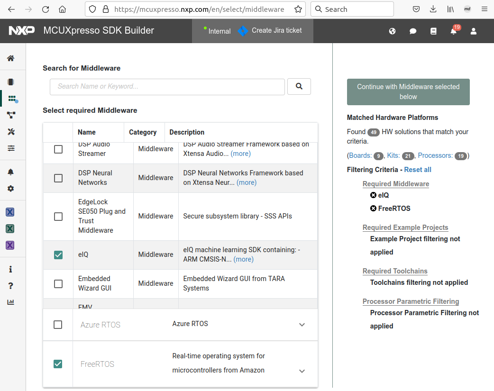
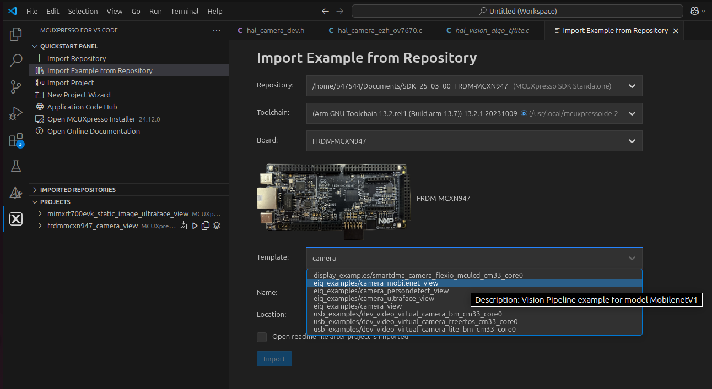
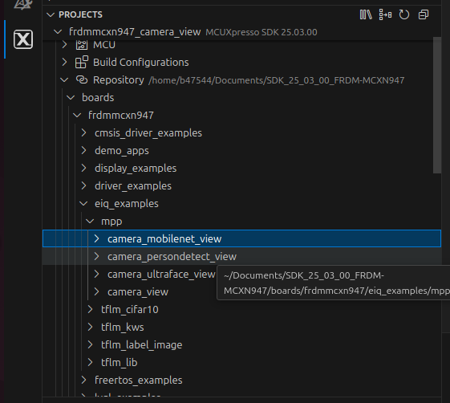
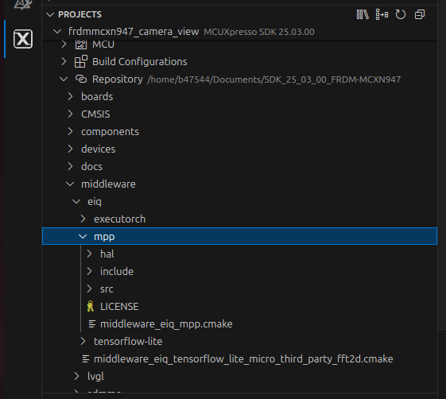
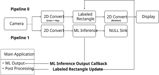
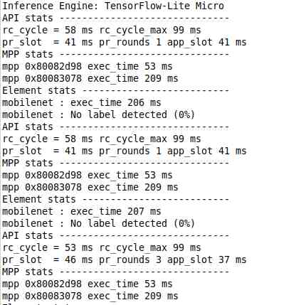

# eIQ Media Processing Pipeline Overview

This document describes the MCU Media Processing Pipeline API.

## 1. Features

The Media Processing Pipeline for MCUs is a software library for constructing graphs of media-handling components for Vision-specific applications.

This is a clean and simple API which makes it easy to build and prototype vision-based applications.

**1.1 Concept**

The concept behind the API is to create a Media Processing Pipeline (MPP) based on processing elements. The basic pipeline structure - the *mpp* in the API context - has a chain/queue structure which begins with a **source element**:

- Camera
- Static image

The pipeline continues with multiple **processing elements** having a single input and a single output:

- Image format conversion
- Image decoder/decompressor
- Labeled rectangle and landmarks drawing
- Machine learning inference with the Tensorflow Lite Micro framework

The pipeline can be closed by adding a **sink element**:

- Display panel
- Null sink

An *mpp* can also be **split** when the same media stream must follow different processing paths.

Compatibility of elements and supplied parameters are checked at each step and only compatible elements can be added in an unequivocal way.

After the construction is complete, each *mpp* must be started for all hardware and software required to run the pipeline to initialize. Pipeline processing begins as soon as the the last start call is flagged.

Each pipeline branch can be stopped individually. The process involves stopping the execution and the hardware peripherals of the branch. After being stopped, each branch can be started again. To stop the whole pipeline, you must stop each of its branches separately.

At runtime, the application receives events from the pipeline processing and may use these events to update the elements parameters. For example, in object detection when the label of a bounding box must be updated whenever a new object is detected.

Summarizing, the application controls:

- Creation of the pipeline
- Instantiation of processing elements
- Connection of elements to each other
- Reception of callbacks based on specific events
- Updating specific elements (not all elements can be updated)
- Stopping branch of the pipeline (includes shut down of the hardware peripherals)

Application does not control:

- Memory management
- Data structures management

The order in which an element is added to the pipeline defines its position within this pipeline, therefore the order is important.

## 2. Deployment

The eIQ Media Processing Pipeline is part of the eIQ machine learning software package, which is an optional middleware component of MCUXpresso SDK.

The eIQ component is integrated into the MCUXpresso SDK Builder delivery system available on [mcuxpresso.nxp.com](https://mcuxpresso.nxp.com/).

To include eIQ Media Processing Pipeline into the MCUXpresso SDK package, select both “eIQ” and “FreeRTOS” in the software component selector on the SDK Builder page.

For details, see, [Figure 1](#figure-1).

**Figure 1. MCUXpresso SDK Builder software component selector**

Once the MCUXpresso SDK board package is downloaded, it can be extracted on a local machine or imported into the Visual Studio Code IDE. For more information on the MCUXpresso SDK board support package, see the section Getting Started > Zip package.

**2.1. How to get example applications**

The eIQ Media Processing Pipeline is provided with a set of example applications. For details, see [Table 1](#table-1). The applications demonstrate the usage of the API in several use cases.

**Table 1. Example applications**

|**Name**|**Description**|**Availability**|
| - | - | - |
|camera\_view|This basic example shows how to use the library to create a simple camera preview pipeline.|EVKB-MIMXRT1170 EVK-IMXRT700 FRDM-MCXN947|
|camera\_mobilenet\_view|
This example shows how to use the library to create an image classification use case using camera as a source.

The machine learning framework used is TensorFlow Lite Micro.

The image classification model used is quantized Mobilenet convolutional neural network model that classifies the input image into one of 1000 output classes.
|EVKB-MIMXRT1170 FRDM-MCXN947|
|camera\_ultraface\_view|
This example shows how to use the library to create a use case for face detection using camera as a source.

To generate a new static image for this example, see the documentation at: eiq/mpp/tools/image\_ conversion.readme.

The machine learning framework used is TensorFlow Lite Micro.

The face detection model used is a quantized Ultraface slim model that detects multiple faces in an input image.
|EVKB-MIMXRT1170 FRDM-MCXN947|
|camera\_persondetect\_view|
This example shows how to use the library to create a use case for person detection using camera as a source.

To generate a new static image for this example, see the documentation at: eiq/mpp/tools/image\_ conversion.readme.

The machine learning framework used is TensorFlow Lite Micro.

The person detection model used is a quantized FastestDet model that detects multiple persons in an input image.
|EVKB-MIMXRT1170 FRDM-MCXN947|
|static\_image\_nanodet\_ m\_view|
This example shows how to use the library to create an object detection use case using a static image as a source.

The machine learning framework is TensorFlow Lite Micro.

The object detection model used is quantized Nanodet m with two output tensors. The model performs multiple objects detection among 80 classes.

The application also performs Intersection Over Union (IOU) and Non-Maximum Suppression (NMS) to pick the best box for each detected object.
|EVKB-MIMXRT1170 EVK-IMXRT700 FRDM-MCXN947|

When using Visual Studio Code IDE, the example applications can be imported through the MCUXpresso plugin in Quickstart Panel > Import Example from Repository as shown in [Figure 2](#figure-2).

**Figure 2. MCUXpresso SDK import projects wizard**

The *boards* directory contains example application projects for supported toolchains, see [Figure 3](#figure-3). 
When using Command line, the example applications can be built using scripts for GCC toolchain in SDK folder /boards/<board\_name>/eiq\_examples/ <example\_name>/armgcc/.

**Figure 3. MCUXpresso SDK board package directory structure for examples**
 
The *middleware/eiq* directory contains contains both the Inference engine code and the Media Processing Pipeline code in folder 'mpp', see [Figure 4](#figure-4).

**Figure 4. MCUXpresso SDK board package directory structure for mpp**

## 3. Example

This section provides a short description of the camera\_mobilenet\_view application.

This example shows how to use the library to create a use case for image classification using camera as source.

The image classification model used is quantized Mobilenet convolutional neural network model that classifies the input image into one of 1000 output classes. Find more pre-trained  models at <https://www.tensorflow.org/lite/models>.

**3.1 High-level description**

**Figure 5. Application overview**
 

**3.2 Detailed description**

The application creates two pipelines:
- One pipeline that runs the camera preview.
- Another pipeline that runs the ML inference on the image coming from the camera.
- Pipeline 1 is split from Pipeline 0.
- Pipeline 0 executes the processing of each element sequentially and cannot be preempted by another pipeline.
- Pipeline 1 executes the processing of each element sequentially but can be preempted.

**3.3 Pipelines elements description**

- Camera element is configured for a specific pixel format and resolution (board dependent).
- Display element is configured for a specific pixel format and resolution (board dependent).
- 2D converts element on pipeline 0 is configured to perform:
  - color space conversion from the camera pixel format to the display pixel format.
  - rotation depending on the display orientation compared to the landscape mode.

    ***Note:**  To get labels in the right orientation, the rotation is performed after the labeled-rectangle.*

- 2D converts element on pipeline 1 is configured to perform:
  - color space conversion from the camera pixel format to RGB888.
  - cropping to maintain image aspect ratio.
  - scaling to 128 \* 128 as mandated by the image classification model.
- The labeled rectangle element draws a crop window from which the camera image is sent to the ML inference element. The labeled rectangle element also displays the label of the object detected.
- The ML inference element runs an inference on the image pre-processed by the 2D convert element.
- The NULL sink element closes pipeline 1 (in MPP concept, only sink elements can close a pipeline).
- At every inference, the ML inference element invokes a callback containing the inference outputs. These outputs are post-processed by the callback client component. In this case, it is the main task of the application.

**3.4 Example output**

After building the example application and downloading it to the target, the execution stops in the *main* function. When the execution resumes, an output message displays on the connected terminal. For example, [Figure 6](#figure-6) shows the output of the camera\_mobilenet\_view\_tflm example application printed to the  PuTTY console window.

**Figure 6. PuTTY console window**

